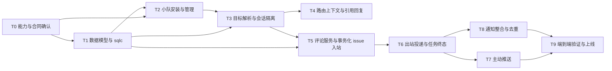

# 飞书小队消息路由实现计划

> 本文是《飞书小队消息路由方案》的落地计划，重点回答怎么拆、先做什么、每一步如何验收。产品规则和边界仍以[方案文档](./feishu-squad-message-routing.md)为准。

## 当前实现状态

首版主链路已经落入 `codex/feishu-message-routing`：安装支持 `agent | squad` 目标；小队详情可发起扫码绑定；普通聊天按实际 agent 隔离；`/route` 支持 issue、agent、状态和取消；issue 入站把成员评论、指定 agent task、delivery、去重与一次性路由消费放在同一事务；chat 与 issue 回复都会记录飞书 message ID，引用后可恢复原路由；任务失败、取消和无输出有终态反馈；agent 可通过 `multica feishu push` 主动发给安装人。

主动推送命令示例：

```bash
multica feishu push \
  --installation-id <installation-uuid> \
  --content "需要你确认一下方案" \
  --idempotency-key "task-123:review-request" \
  --issue-id <issue-uuid>
```

Server 在下发小队成员任务时，会把可用 Bot 的 `installation-id` 和完整命令追加到该 Agent 的运行指令中。Runtime 侧同时需要安装包含 `multica feishu push` 的新版 CLI/Daemon；新版 Daemon 会在运行说明中公开该命令，只有一个可用 Bot 时 CLI 允许省略 `--installation-id`，有多个 Bot 时必须显式选择。

有 issue 的主动新内容会作为 agent 评论保存，但不触发其他 agent；没有 issue 时会先保存到该 agent 面向安装人的 chat session。两种消息都可按 `reply_policy` 控制引用回复，默认分别为 `issue_route` 和 `chat_route`。`disabled` 会明确拒绝引用路由。

## 1. 交付目标

这次改造要把当前“一个飞书机器人固定绑定一个智能体”的实现，升级成“一个机器人绑定一个工作区内的小队，由后端按消息上下文选择 issue 和智能体”的路由系统。

完整交付后应具备以下能力：

- 小队只需绑定一个飞书机器人，队长和队员共用该入口。
- 群聊里回复到来源群，私聊里回复到原私聊。
- 用户可以选择工作区内已有的 issue 和小队内智能体，并把消息送入唯一的 `issue + agent` runtime session。
- 只指定 issue 时，按方案规则解析目标智能体；既不指定 issue 也不指定智能体时，进入小队队长的普通聊天。
- 引用机器人发出的消息时，可以恢复原始 issue、智能体和任务路由。
- 智能体可以通过统一内部接口主动推送；默认收件人是安装机器人的飞书用户，且不会越过工作区和小队边界。
- issue 内的用户输入、智能体输出、飞书回执和通知有明确的持久化、触发与去重规则。

## 2. 当前实现与主要缺口

现有飞书通道已经有安装、用户绑定、会话绑定、入站去重、普通聊天任务和部分出站回复能力，可以复用底层鉴权、长连接、消息发送和线程降级逻辑。不过，路由模型仍然是单智能体模型：

- `channel_installation` 直接保存必填 `agent_id`，安装唯一性也按智能体计算。
- `channel_chat_session_binding` 只按“安装 + 飞书会话”定位，无法隔离同一会话下的不同智能体。
- 入站引擎在确定目标之前就创建会话，并始终使用安装记录上的智能体。
- 群聊只识别 @ 机器人，尚未根据被引用消息恢复路由。
- issue 评论创建、评论事件发布和任务触发集中在 Handler，无法直接支持 `explicit / normal / none` 三种触发方式，也不便把评论、任务、投递意图放进同一事务。
- 出站监听主要处理普通聊天完成和任务失败，不能表达“一次任务产生多条评论，只把属于来源任务的内容回给飞书”。
- 主动推送缺少稳定的内部服务接口、投递记录和命令行入口。

因此，这不是在现有 Router 上增加几个分支就能完成的功能。需要先把安装目标、路由上下文、评论触发和消息投递拆成独立领域能力，再接回飞书适配器。

## 3. 实现原则和关键取舍

### 3.1 安装绑定小队，实际目标动态解析

安装记录增加 `target_type` 和 `target_id`，支持 `agent` 与 `squad` 两种目标。已有安装回填为 `agent`，保证当前用法不受影响。小队安装不保存“绑定时的队长”作为长期路由依据，每次走默认路由时读取当前队长，避免队长变更后继续投递到旧智能体。

### 3.2 会话以实际智能体隔离

普通聊天会话绑定调整为：

```text
installation + channel conversation + actual agent -> chat session
```

数据库中显式保存实际 `agent_id`，不把它藏在拼接字符串里。这样同一个飞书私聊或群聊切换智能体时，历史上下文不会互相污染。

### 3.3 issue 入站必须事务化

一条指向 issue 的飞书消息需要在同一个数据库事务中完成：

1. 确认入站消息尚未处理；
2. 写入成员评论；
3. 根据触发模式创建且只创建一次目标任务；
4. 创建回传飞书的投递意图；
5. 消耗一次性路由选择；
6. 标记入站消息完成。

事务提交后再发布评论事件、任务事件并唤醒执行器。这样即使进程在任意一步退出，也不会出现评论已存在但任务丢失，或同一条消息触发两个任务的情况。

### 3.4 评论持久化、任务触发、外部投递相互独立

评论服务提供三种明确模式：

- `explicit`：调用方给出唯一目标智能体，只创建该智能体的任务；用于飞书定向消息。
- `normal`：沿用 Multica 内已有的 @、父评论、会话线程和负责人推导逻辑；用于产品内正常评论。
- `none`：只写评论，不触发任务；用于智能体主动推送时补写展示评论等场景。

“评论落库”不再隐含“一定触发智能体”，任务完成也不再隐含“一定发到飞书”。是否外发由投递记录决定。

### 3.5 投递意图与实际消息分开保存

建议新增两层记录：

- `channel_delivery`：一次业务投递意图，保存来源、目标会话、接收人、路由、状态和关联任务；任务可为空，以支持主动推送和事件通知。
- `channel_delivery_message`：一次实际外发消息，保存来源评论、飞书消息 ID、幂等键、尝试次数和结果。

这种拆分可以直接表达“一次任务产生多条评论”“同一评论发给多个接收人”“主动推送没有任务”三类情况，也给引用回复提供稳定的反向索引。

### 3.6 斜杠命令是第一版唯一的路由选择入口

用户通过 `/route` 直接设置下一条消息的 issue 和智能体，不需要先请求机器人发卡片，也不需要等待另一轮交互。命令设置成功后立即返回目标摘要，用户随后发送内容；引用一条已经带路由记录的机器人回复时，则直接恢复原路由，不需要再次执行命令。

## 4. 交付阶段

| 阶段 | 结果 | 包含任务 | 前置条件 |
| --- | --- | --- | --- |
| P0 合同确认 | 飞书能力与内部模型没有未验证假设 | T0 | 无 |
| P1 数据与安装 | 小队机器人可安装、查询、撤销，旧安装兼容 | T1、T2 | T0 |
| P2 入站路由 | 四类目标组合、引用回复和一次性选择可稳定入站 | T3、T4、T5 | T1、T2 |
| P3 出站与主动推送 | 任务结果、终态和主动消息可靠送达 | T6、T7 | T3、T5 |
| P4 通知整合 | 直接回复与订阅通知正确去重 | T8 | T6 |
| P5 上线准备 | 端到端回归、观测、灰度和回滚完备 | T9 | 前述任务 |

建议把每个任务做成独立 PR。P1、P2 和 P3 是首个可用版本的主链路；P4 可以在斜杠命令路由已可用后并行推进。



## 5. 任务拆解

### T0. 飞书能力与接口合同确认

目标是验证主动推送最容易造成返工的外部假设，并冻结内部枚举和幂等语义。

主要工作：

- 确认机器人向安装用户 `open_id` 主动发消息所需权限、会话创建行为及错误码。
- 固化 `installation target`、`route kind`、`trigger mode`、`delivery kind`、`reply policy`、终态原因等枚举。
- 定义幂等键：入站消息、路由选择、任务投递、评论外发和终态反馈分别使用什么稳定标识。
- 给出敏感字段边界：日志和审计只保留 ID、路由结果、耗时和错误分类，不记录正文、令牌及密钥。

交付物：一份短 ADR、飞书能力验证测试或可复现脚本，以及冻结后的类型定义草案。

完成标准：主动私信有可运行证据；如果平台能力不支持，替代入口已写入 ADR，后续任务不再依赖猜测。

### T1. 数据模型、迁移与 sqlc 查询

目标是为小队安装、实际智能体会话、一次性路由和可靠投递建立持久化基础。

主要工作：

- 扩展 `channel_installation`：增加 `target_type`、`target_id`，回填已有 `agent_id` 安装；过渡期保留旧字段读取，待所有调用点迁移后再清理。
- 扩展 `channel_chat_session_binding`：增加实际 `agent_id`，唯一性变为“安装 + 飞书会话 + 智能体”。
- 新增一次性路由上下文表，保存安装、飞书会话、飞书用户、issue、智能体、来源消息、过期时间、消耗时间和版本。
- 新增 `channel_delivery` 与 `channel_delivery_message`，覆盖 conversation reply、proactive push、event notification 三类投递。
- 为飞书消息 ID、来源任务、来源评论、待发送状态、未消费路由等访问路径建立索引。
- 补充工作区删除、小队删除、智能体删除、issue 删除和安装撤销时的显式清理查询；不增加外键或级联删除。
- 运行 sqlc，更新 store 层映射和测试夹具。

迁移要求：

- 每个并发索引单独放在只含一条语句的迁移文件中，使用 `CREATE [UNIQUE] INDEX CONCURRENTLY`。
- 需要约束复用索引时，先并发建唯一索引，再用后续迁移挂接约束，避免隐式创建普通索引。
- 迁移必须覆盖旧安装和旧会话绑定的回填、升级与降级路径。

重点文件：

- `server/migrations/`
- `server/pkg/db/queries/channel.sql`
- `server/pkg/db/queries/workspace_delete.sql`
- `server/internal/integrations/lark/store.go`

测试：迁移 lint、升级/降级集成测试、唯一性冲突、过期路由清理、投递幂等和显式清理测试。

完成标准：旧数据库可无损升级；同一飞书会话能分别绑定两个智能体会话；重复入站、重复投递和重复路由消费均由数据库约束或条件更新拦截。

### T2. 小队安装、授权和管理界面

目标是让机器人真正绑定到小队，并记录安装用户在工作区内的飞书身份。

主要工作：

- 安装 API 改为接收 `target_type + target_id`，兼容原有智能体安装请求。
- 小队安装校验：目标小队属于当前工作区，操作者具备管理权限，小队有有效队长。
- 安装完成时保存安装者的 Multica 用户、飞书 `open_id`、工作区和安装关系，作为主动推送默认接收人。
- 列表和撤销 API 返回目标类型、目标名称和当前队长；撤销时清理待处理路由和投递。
- 在小队详情页增加飞书绑定与管理入口；现有智能体集成页继续展示历史智能体安装。
- 前端为新旧响应增加 Zod schema 和兼容解析；未知枚举或缺失字段应降级展示，不能使整个设置页面崩溃。
- 补齐简体中文、英文、日文和韩文文案。

重点文件：

- `server/internal/integrations/lark/installation.go`
- `server/internal/integrations/lark/registration_service.go`
- `server/internal/handler/lark.go`
- `packages/core/types/lark.ts`
- `packages/core/api/client.ts`
- `packages/core/lark/queries.ts`
- `packages/views/squads/components/squad-detail-page.tsx`

测试：智能体旧安装兼容、小队安装与撤销、跨工作区拒绝、非管理员拒绝、队长变更、恶意 API 响应、重复安装及多语言 UI 测试。

完成标准：用户能在小队详情页完成安装和撤销；后端能从安装记录稳定得到工作区、小队和安装用户；修改小队队长后默认路由无需重新绑定。

### T3. 目标解析、授权与普通聊天会话隔离

目标是把“安装目标”和“本次消息的实际目标”分开，形成唯一的路由决策入口。

主要工作：

- 新增 `TargetResolver`，输入安装、发送人、飞书会话、可选 issue、可选智能体和引用消息，输出实际 issue、实际智能体、路由类型或面向用户的拒绝原因。
- 实现四类组合：无 issue/无智能体、无 issue/有智能体、有 issue/有智能体、有 issue/无智能体。
- issue-only 路由按方案处理：负责人是本小队成员则选负责人；负责人为空或为普通成员时提示用户选择；负责人属于其他小队时拒绝。
- 每次解析都校验工作区、安装小队、issue 和智能体边界。群内任何人可以发起路由，但不能借此访问其他工作区或小队。
- 调整入站 Router：先解析目标，再按实际智能体创建或获取普通聊天 session。
- 会话查询加上实际 `agent_id`；验证切换智能体后不会复用错误 session。

重点文件：

- `server/internal/integrations/channel/engine/router.go`
- `server/internal/integrations/channel/engine/resolvers.go`
- `server/internal/integrations/channel/engine/session.go`
- `server/internal/integrations/lark/resolver.go`

测试：四种路由组合、队长变更、issue 负责人变化、跨小队/跨工作区拒绝、同一会话切换智能体、并发首次创建 session。

完成标准：所有入站消息只有在目标和权限确定后才写会话或评论；普通聊天上下文以实际智能体隔离。

### T4. 一次性路由上下文、文本选择和引用回复

目标是让用户能选择下一条消息的目标，并让后续引用回复自动回到原 issue 和智能体。

主要工作：

- 提供按编号或唯一 ID 解析当前工作区可见 issue、按名称或唯一 ID 解析安装小队成员的服务接口。
- 实现 `/route --issue MUL-123 --agent @AgentName`、`/route --issue MUL-123`、`/route --agent @AgentName`、`/route status`、`/route cancel` 和 `/route help`。
- 设置命令成功后立即回复目标摘要和有效期，不再发送选择卡片；名称不唯一时拒绝选择并提示使用唯一 ID。
- 路由上下文以“安装 + 飞书会话 + 飞书用户”隔离，带过期时间和版本，最后一次选择覆盖未消费选择。
- 只有当业务入站事务成功提交后才消费选择。帮助命令、非法消息、权限失败和临时错误都不得提前消费。
- 每次成功外发后保存飞书消息 ID 与原始 issue、智能体、任务和投递记录的关联。
- 入站先解析 `ReplyTo`：若引用的是已记录的机器人消息，恢复其路由；若记录过期、目标已删除或权限已变化，则给出明确提示，不静默转给队长。
- 群聊准入调整为“@ 机器人”或“回复一条可识别的机器人消息”；普通无关消息继续忽略。

测试：选择覆盖、过期、取消、失败不消费、成功只消费一次、两个用户并行选择、群聊引用、私聊引用、已删除目标、伪造引用和重复事件。

完成标准：一次性选择没有串用户、串群或重复消费；引用任意已记录的路由消息时，能恢复到正确的 issue 和智能体。

### T5. 评论领域服务与事务化 issue 入站

目标是统一评论落库和任务触发规则，保证一条飞书消息只产生一条成员评论和一个预期任务。

主要工作：

- 从 `server/internal/handler/comment.go` 提取可复用的评论应用服务，Handler 只负责 HTTP 参数、鉴权和响应。
- 实现 `explicit / normal / none` 三种触发模式；现有产品内评论走 `normal`，飞书定向 issue 消息走 `explicit`。
- 为任务服务增加事务内创建能力，避免评论先提交、任务后创建的半完成状态。
- 实现 issue 入站事务：去重、成员评论、显式目标任务、投递意图、一次性路由消费和入站完成标记一次提交。
- 事务提交后再发布 `comment:created`、任务事件并通知执行器；提交失败不产生外部副作用。
- 直接请求无论成功、失败、取消、超时或无输出，都保留可追踪的投递终态。

重点文件：

- `server/internal/handler/comment.go`
- `server/internal/service/task.go`
- `server/internal/integrations/channel/engine/router.go`
- 新增评论应用服务及其事务接口

测试：三种触发模式、精确目标、评论与任务原子性、重复入站、事务回滚、提交后事件、执行器通知失败恢复、issue 已关闭/删除和智能体失效。

完成标准：`issue + agent` 消息恰好写入一条成员评论并创建一个该智能体任务；`none` 永不触发任务；任意事务失败都不会留下半成品。

### T6. 出站投递、来源任务过滤和终态反馈

目标是让直接请求产生的内容和终态可靠回到来源会话，同时避免把 issue 中无关智能体的评论带回去。

主要工作：

- 新增通道无关的 `DeliveryDispatcher`，飞书只负责把标准投递转换为文本或 Markdown。
- 监听评论创建和任务终态。只有 `source_task_id` 等于投递来源任务的智能体评论，才作为该请求的回复外发。
- 一个任务的多条合法评论按产生顺序逐条外发，并分别写入 `channel_delivery_message`。
- 成功、失败、取消、超时、无输出都发送终态反馈；错误内容使用安全分类，不能暴露密钥、内部栈或原始请求体。
- 保存每条发送成功的飞书消息 ID，为引用回复建立反向索引。
- 使用持久化状态机和租约/重试机制处理发送中断；重复事件只重试未完成消息，不重复发送已成功消息。
- 复用现有群话题回复与降级策略；若来源会话不可用，按方案决定提示安装用户或标记为不可投递。

重点文件：

- `server/internal/integrations/lark/outbound.go`
- `server/internal/integrations/lark/client.go`
- `server/internal/integrations/lark/http_client.go`
- 新增通道投递服务和调度器

测试：单条/多条输出、其他任务评论过滤、乱序事件、重复事件、部分发送成功后重启、限流重试、无输出、失败/取消/超时、群话题降级及消息 ID 回写。

完成标准：直接请求最终一定进入可审计终态；重放同一事件不会产生重复飞书消息；引用任一已发送消息都能查到原路由。

### T7. 智能体主动推送接口与 CLI

目标是提供任何智能体都能调用、但严格受工作区和小队约束的主动推送能力。

主要工作：

- 新增内部 `DeliveryService`，参数至少包含调用智能体、安装、可选 issue、内容、幂等键和回复策略。
- 默认收件人从安装记录读取机器人安装者的飞书 `open_id`；调用方不能任意指定其他飞书用户。
- 有 issue 时：允许引用已有智能体评论，或以 `none` 模式补写一条智能体评论，再创建主动投递。
- 无 issue 时：把内容写入该智能体的普通聊天 session，再创建主动投递，不写 issue 评论。
- 调用智能体必须属于安装小队；跨工作区、跨小队、已撤销安装和失效用户均拒绝。
- 增加 `multica` CLI 子命令，并同步命令清单、内置技能说明和 source map，使 runtime 中的智能体可以稳定调用。
- 定义 `disabled / chat_route / issue_route` 回复策略。允许回复时，外发消息必须保存足够的反向路由信息。

重点文件：

- `server/cmd/multica/`
- `server/cmd/multica/main.go`
- `server/internal/service/builtin_skills/`
- `scripts/agent-cli-command-names.txt`
- 新增 DeliveryService 与 CLI client

测试：小队任一智能体调用、有/无 issue、已有/新建评论、幂等调用、撤销安装、跨小队拒绝、安装用户失效、回复策略和 CLI 合同测试。

完成标准：同一幂等键重复调用只产生一组投递；合法调用送达安装用户；非法目标不创建评论、聊天消息或投递记录。

### T8. 通知整合与重复抑制

目标是让“直接回复”和“订阅通知”各司其职，同一条评论不会以两种方式重复发给同一用户。

主要工作：

- 在通知决策层识别直接请求的来源用户和已成功投递的评论。
- 同一评论已作为 conversation reply 发给某用户时，对该用户抑制 `new_comment` 通知；其他订阅者仍正常收到通知。
- `event_notification` 使用独立投递类型，不创建 runtime 任务，也不改变一次性路由上下文。
- 明确系统评论、成员评论、智能体评论和任务失败对各类接收人的通知矩阵。
- 通知发送同样写入投递消息表，使用收件人级幂等键。

重点文件：

- `server/cmd/server/notification_listeners.go`
- 通知服务和 DeliveryDispatcher

测试：来源用户去重、其他订阅者保留、多个接收人、重复评论事件、直接回复失败后的通知策略和系统评论忽略。

完成标准：同一用户不会同时收到内容相同的直接回复和新评论通知；抑制是按接收人计算，不影响其他订阅者。

### T9. 可观测性、端到端验证与上线

目标是让新链路可定位、可灰度、可回滚，而不是只在理想路径下工作。

主要工作：

- 为入站、路由、评论、任务、投递建立统一关联 ID，并记录安装、会话、issue、智能体、任务和投递 ID。
- 增加指标：入站去重、路由拒绝原因、路由解析耗时、任务创建失败、投递积压、重试次数、终态分布和引用恢复失败。
- 增加过期路由、失效消息映射和长期终态投递的清理任务。
- 编写端到端矩阵，覆盖私聊、群聊、@、引用、四种目标组合、主动推送、通知、错误终态和服务重启。
- 设计上线顺序：数据库迁移 → 兼容后端 → 新管理 UI → 指定工作区启用 → 扩大范围。
- 准备回滚方案：停止新小队安装和新路由，不删除已写入的路由/投递数据；旧智能体安装继续可用。
- 更新开发者文档、飞书安装说明、CLI 帮助和故障排查手册。

性能目标：

- 已接收且无需等待智能体执行的直接反馈，服务端调度 P95 不高于 5 秒。
- 重复飞书事件不增加任务数或成员评论数。
- 投递重试期间可从数据库判断当前阶段、最近错误和下一次重试时间。

测试命令至少包含：

```bash
make lint-migrations
make sqlc
make test
pnpm typecheck
pnpm test
make check
```

完成标准：验收矩阵全部通过，指标和审计能定位一条消息的全链路，灰度期间可以只关闭新路由而保留原有飞书能力。

## 6. PR 建议与依赖边界

建议按以下 PR 边界交付，避免一个 PR 同时修改数据库、核心路由、UI 和通知：

1. `schema(channel): add routed installation and delivery persistence`
2. `feat(lark): support squad installation and management`
3. `refactor(channel): resolve actual target before session binding`
4. `feat(channel): add one-shot route context and reply routing`
5. `refactor(comments): introduce trigger modes and transactional ingress`
6. `feat(channel): dispatch routed task output and terminal feedback`
7. `feat(multica-cli): add proactive channel delivery`
8. `feat(notifications): suppress duplicate direct-reply notifications`
9. `test(channel): add end-to-end routing and recovery coverage`

数据库 PR 必须先于依赖新列的服务代码上线。服务端在过渡期同时读取旧智能体安装和新目标安装；前端不能假设所有环境已经返回新字段。评论服务抽取完成前，不应在飞书 Router 中复制一套评论触发逻辑。

## 7. 验收目标映射

| 方案验收目标 | 负责任务 | 自动化证据 |
| --- | --- | --- |
| 一个小队共用一个机器人 | T1、T2、T3 | 安装 API、授权与队长变更测试 |
| 群聊回来源群，私聊回原会话 | T3、T6 | 群/私聊集成测试 |
| 四类 issue/智能体组合 | T3、T5 | 路由参数化测试 |
| issue + agent 进入唯一历史上下文 | T3、T5 | session/task 归属断言 |
| 一次性选择只在成功后消费 | T4、T5 | 回滚、重试和并发测试 |
| 引用消息恢复原路由 | T4、T6 | 飞书消息 ID 反查测试 |
| 群内任何人可用但不可越权 | T3、T4、T8 | 多用户与跨边界拒绝测试 |
| issue 消息落评论且只触发目标智能体 | T5 | 评论、任务数量与目标断言 |
| 任务输出只回传来源任务评论 | T6 | 多任务交错与 source_task 过滤测试 |
| 成功、失败、取消、超时、无输出都有反馈 | T6 | 终态参数化测试 |
| 任意队员可主动推送给安装者 | T7 | 主动推送授权和送达测试 |
| 主动推送不越过小队 | T7 | 跨小队/工作区拒绝测试 |
| 直接回复与评论通知不重复 | T8 | 收件人级去重测试 |
| 事件重放和服务重启不重复发送 | T1、T5、T6 | 幂等与故障恢复测试 |
| 老的单智能体安装继续工作 | T1、T2、T9 | 兼容 API 和回归测试 |
| 全链路可审计且不记录敏感正文 | T0、T9 | 日志字段与审计测试 |

## 8. 风险和控制措施

### 斜杠命令参数产生歧义

issue 优先使用编号或唯一 ID，智能体名称只在小队内唯一时才接受；解析到多个目标时拒绝设置路由，并返回候选项和唯一 ID。命令解析和权限解析分开，任何参数都不能直接变成数据库对象。

### 评论事务改造影响现有产品内评论

先用特征测试固定当前 `normal` 触发行为，再抽取服务。HTTP Handler 的对外响应和现有 WebSocket 事件保持不变；飞书新增路径只使用 `explicit`，避免互相渗透。

### 重复事件和部分发送造成重复消息

入站、任务投递和实际消息分别使用稳定幂等键。发送成功后立即保存平台消息 ID；进程重启时只认数据库状态，不依赖内存标记。

### 队长、负责人和小队成员在路由后发生变化

选择阶段展示当前状态，真正入站时再次授权。一次性路由保存的是用户意图，但不能跳过发送时校验；权限变化时明确失败，不自动降级到其他智能体。

### 新旧安装模型并存

采用数据库先行和加法式 API 演进。旧 `agent` 安装在整个发布周期内继续可读写；清理旧字段单独立项，至少等所有已部署客户端完成升级后再做。

## 9. 首个可演示里程碑

首个演示不等待完整通知整合，范围建议锁定为：

- 在小队详情页绑定一个飞书机器人。
- 私聊或群聊 @ 机器人时，默认进入当前队长普通聊天。
- 通过文本选择 issue 和小队成员，下一条消息以成员评论落入 issue，并只触发所选智能体。
- 智能体输出回到来源会话，失败和无输出有明确反馈。
- 引用该回复后继续进入同一 issue 和智能体。
- 重放入站事件不会新增评论、任务或飞书回复。

这个里程碑完成后，再接入主动推送和通知去重。第一版不规划交互卡片，路由选择统一使用斜杠命令。
