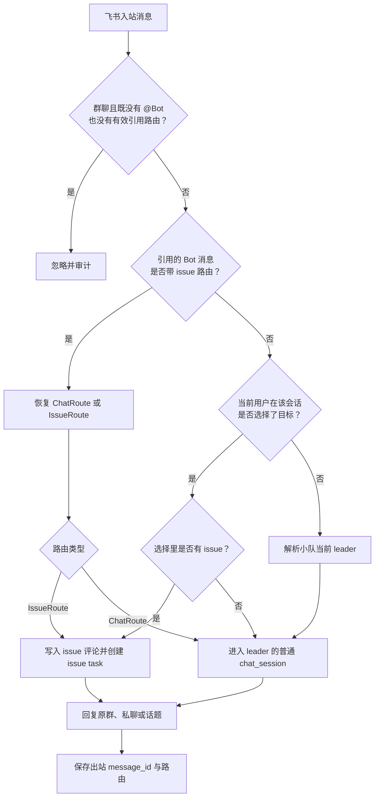

# 飞书小队消息路由方案

## 背景

Multica 当前把一个飞书 Bot 绑定到一个 agent。这个模型实现简单，但真正放进小队使用后很快会遇到两个问题：小队里有多少个 agent，就要创建多少个 Bot；用户在飞书里看到的是一排机器人，很难确认自己正在和谁说话。

更自然的入口应该是“小队 Bot”。一个小队只绑定队长的飞书 Bot，队长作为默认接收者，小队里的其他 agent 通过消息路由被选中。用户仍然只面对一个 Bot，但可以在需要时把消息送进某个 issue 上某个 agent 的既有上下文。

这份文档先记录产品需求，再结合当前实现说明可行性和建议的落地路径。它是设计草案，不代表已经完成实现。

## 需求记录

### 一个 Bot 服务整个小队

- 一个小队只需要绑定一个飞书 Bot，绑定入口归属于小队，而不是要求每个 agent 单独绑定。
- 小队 leader 是默认 agent。没有明确路由信息的消息继续交给 leader。
- 用户可以通过这个 Bot 找到小队内的其他 agent，不再为每个 agent 创建独立机器人。
- 小队更换 leader 后，Bot 仍归属于原小队，默认路由自动跟随新 leader。

### 回复回到消息来源

- 在飞书群里 `@Bot` 触发的任务，结果回到原群。消息位于话题中时，结果继续回到原话题。
- 私聊 Bot 触发的任务，结果回到原私聊会话。
- 普通群消息没有 `@Bot`、也不是回复一条带 Multica 路由信息的 Bot 消息时，不触发 agent。

### agent 主动推送

- agent 明确发起主动推送时，消息发送给这个 Bot 的绑定人。
- 安装时需要建立“Multica 用户 ↔ 飞书用户”的身份关系，主动发送时能解析出接收人的飞书身份。
- 用户直接引用这条主动消息回复时，系统应恢复该消息背后的 `issue + agent` 路由，把回复送回同一个上下文。

这里的“主动推送”应是显式动作，例如 agent 调用 channel send 工具或产生明确的投递意图。不能把 agent 在 issue 中写下的所有评论都默认推送到飞书，否则小队协作会产生大量噪声，也容易把不适合外发的内容送出工作区。

### 在飞书中选择 issue 和 agent

- 用户可以在飞书会话中，从自己有权访问的现有 issue 和小队 agent 中选择目标。issue 和 agent 可以同时选择，也可以只选择其中一个。
- issue 和 agent 的候选范围来自当前 Bot 所属的 Multica workspace，不能跨工作区搜索或路由。
- 选择只影响下一条有效内容消息。路由命令、空消息和处理失败的消息不消费选择；评论、chat message 和 task 成功创建后才标记已消费。
- 没有选择目标、也没有引用带路由信息的 Bot 消息时，消息按无上下文聊天处理，交给小队 leader。
- agent 回复发到飞书后，用户引用该消息继续回复，无需重新选择目标。系统根据出站消息记录判断应该继续普通 chat，还是回到 `issue + agent`。

### 飞书用户与 workspace 的关联

- Bot 安装始终属于一个明确的 Multica workspace。无论安装目标是 agent 还是 squad，目标本身也必须属于这个 workspace。
- 用户绑定飞书身份时，需要同时关联 Multica 用户和该 workspace。一个飞书用户可以分别绑定多个 workspace，但每次绑定都通过对应 Bot installation 隔离。
- 用户在飞书里查看 issue 和 agent 时，先由当前 Bot installation 确定 workspace，再按已绑定的 Multica 用户权限查询该 workspace 的数据。
- 当前 Bot 不需要再让用户选择 workspace，也不能展示其他 workspace 的 issue、agent 或小队。

### 已确定的产品规则

- issue/agent 选择是一次性的，只影响下一条成功受理的内容消息。
- 群聊里任何完成身份绑定、仍有相应权限的成员都可以引用 Bot 回复继续对话，不限最初发起人。
- 主动推送统一走一个 channel delivery service。agent CLI、内置 skill、自动化和服务端代码都可以调用；接口开放不代表匿名发送，每次调用仍需携带并校验来源身份和工作区上下文。
- 小队 Bot 只能路由到当前小队内的 agent。旧消息引用和路由命令执行时都必须重新检查成员关系，不能借历史路由访问已经移出小队的 agent。

## 当前实现与需求的距离

结论是：**整体可实现，并且现有通道层已经具备大部分消息收发基础。真正缺少的是目标解析、issue 路由状态和出站消息关联。**

### 已经具备的能力

现有实现已经完成了下面这些基础工作：

- `channel_installation` 保存 Bot 安装、工作区、绑定 agent、安装人和加密凭据。
- 扫码安装成功时，安装人的飞书 `open_id` 会自动写入 `channel_user_binding`。因此“记录 Bot 主人的飞书 ID”已经有数据基础，不建议再在安装表重复保存一份。
- `channel_user_binding` 本身已经同时保存 `workspace_id`、`installation_id`、`multica_user_id` 和飞书 `channel_user_id`。现有数据模型已经能表达“这个飞书身份在这个 Bot 所属 workspace 中对应哪个 Multica 用户”。
- 入站消息会根据 `app_id` 找到安装，根据飞书用户绑定找到 Multica 用户，并再次检查工作区成员身份。
- 群聊当前只接收明确 `@Bot` 的消息；私聊不要求 @。把“引用一条已记录路由的 Bot 消息”也识别为有效触发，是本方案需要补上的能力。
- 飞书普通群聊、私聊和话题都已经有来源路由。`channel_chat_session_binding` 会保存原始 chat、最近一条消息和 thread，agent 的聊天结果可以回到原群、原私聊或原话题。
- 消息去重、失败审计、附件处理、typing 状态和 agent 回复发送链路都已经存在。

相关实现主要在：

- `server/internal/integrations/channel/engine/router.go`
- `server/internal/integrations/channel/engine/session.go`
- `server/internal/integrations/lark/feishu_resolvers.go`
- `server/internal/integrations/lark/ws_frame_decoder.go`
- `server/internal/integrations/lark/outbound.go`
- `server/pkg/db/queries/channel.sql`

### 当前模型为什么不能直接满足

当前 `channel_installation.agent_id` 是固定值。安装解析完成后，这个 agent 会一路传到 `EnsureSession` 和 `EnqueueChatTask`。也就是说，一个 Bot 的所有普通消息天然只能进入同一个 agent。

此外，飞书消息当前创建的是独立 `chat_session`。chat task 的 `issue_id` 为空，它能延续这段飞书聊天，却不会自动继承某条 issue 上的执行历史。

这里需要澄清一个实现细节：Multica 没有一张“`issue + agent` 唯一 runtime session”表。issue task 在运行时会按 `(agent_id, issue_id)` 找到最近一个可恢复、且 runtime 相同的 provider session。这个行为正好能满足需求，但前提是飞书消息必须进入 **issue task 链路**，不能仍作为普通 chat task 处理。

身份与 workspace 的关系不需要重新设计成全局映射。飞书 `open_id` 是 installation/app 作用域的标识，可靠的绑定键应继续是：

```text
(installation_id, channel_user_id)
  → workspace_id
  → multica_user_id
```

installation 先确定 workspace，用户绑定再确定该 workspace 中的 Multica 身份。后续 issue/agent 查询必须同时使用这两个结果，不能只拿一个飞书 ID 去全局搜索 workspace。

## 建议的路由规则

一次飞书入站消息按下面的优先级决定目标：

1. **引用路由优先。** 如果消息回复了一个由 Multica 发出的、已经记录路由的飞书消息，恢复其 `ChatRoute` 或 `IssueRoute`。
2. **一次性选择其次。** 当前会话和当前用户存在尚未消费的 issue/agent 选择时，根据选择组合解析目标。
3. **默认路由兜底。** 没有选择和引用时，消息进入小队当前 leader 的普通 `chat_session`。
4. **群聊门禁收窄放行。** 群聊仍然要求 `@Bot`；唯一新增的免 @ 场景，是回复一条能在 Multica 中查到有效路由记录的 Bot 消息。普通群聊和无法识别来源的 Bot 消息继续丢弃。

四种选择组合的落点固定如下：

| issue | agent | 落点 |
|---|---|---|
| 未选择 | 未选择 | 小队当前 leader 的普通 `chat_session` |
| 未选择 | 已选择 | 指定 agent 的普通 `chat_session` |
| 已选择 | 已选择 | 写入 issue 评论，触发指定 agent 的 issue task |
| 已选择 | 未选择 | 写入 issue 评论，根据 issue 负责人解析 squad leader 或负责 agent |

agent 出站时使用另一组规则：

1. 由飞书入站消息触发的结果，回到原 chat/thread。
2. 显式主动推送，发给 Bot 绑定人的飞书账号。
3. 每次发送成功后记录飞书消息 ID 及其 `ChatRoute` 或 `IssueRoute`，为后续引用回复提供反向路由。



## 消息持久化、agent 触发与飞书投递

这里需要把三个容易混在一起的动作拆开：一条消息是否成为 issue 评论、是否触发 agent、是否需要投递到飞书。它们之间没有必然的绑定关系。尤其不能订阅所有 `comment:created` 后直接外发，也不能先走普通评论自动路由、再额外创建一个飞书定向 task。

建议固定下面的行为：

| 场景 | 持久化位置 | agent 触发 | 飞书反馈 |
|---|---|---|---|
| 无 issue 的用户消息 | 目标 agent 的 chat session | 创建 chat task | 回原群、私聊或话题 |
| 带 issue 的用户内容 | member issue comment | 只触发路由解析出的 agent | agent 结果回原来源 |
| route 命令 | route context 和审计记录 | 不触发 | 回复选择成功或错误 |
| 权限、参数和路由错误 | delivery 审计 | 不触发 | 直接提示当前用户 |
| issue task 失败、取消或超时 | 建议写无触发的 system comment | 不再次触发 | 必须返回终态错误 |
| issue 状态、负责人、优先级等变化 | issue/activity/inbox | 不触发 | 由通知订阅决定，不写评论 |
| agent 对 issue 的有效回复 | agent issue comment | 保留现有内部协作规则 | 仅按对应 delivery 回原来源 |
| agent 主动推送已有评论 | 复用现有 comment | 不重复触发 | 发给 Bot 绑定人 |
| agent 主动推送新的 issue 内容 | agent issue comment | 默认不触发其他 agent | 发给 Bot 绑定人 |
| agent 主动推送、没有 issue | 目标 agent 的 chat session | 用户回复前不触发 | 发给 Bot 绑定人 |

### 评论触发模式

现有 `CreateComment` 在保存评论后，会继续按明确 mention、回复的 agent、会话延续和 issue 负责人计算任务目标。飞书已经明确解析出目标后，直接复用这条链路可能重复触发，或者把消息交给用户没有选择的 agent。

建议把评论写入 service 下沉，并显式传入触发方式：

```text
trigger_mode
  explicit   只触发调用方指定的 agent 或 squad leader
  normal     使用现有评论路由规则
  none       只保存评论，不触发 agent
```

飞书 IssueRoute 使用 `explicit`；Web、移动端普通评论继续使用 `normal`；task 失败记录和单纯为了主动推送创建的评论使用 `none`。agent 如果确实要通过评论 mention 另一个 agent，仍调用普通评论能力，而不是借主动推送接口隐式委派。

agent 回复评论仍可以参与 Multica 现有的小队内部协作，例如成员 agent 的结果唤醒 issue 所属 squad leader。但这个后续 task 没有当前飞书 delivery，不能自动外发。只有最初被用户选中的 task 输出回到当前飞书会话；后续 agent 若需要对外发言，应显式调用主动推送。

### 直接请求必须有终态反馈

用户从飞书直接发起的 chat task 或 issue task，必须至少收到一个终态结果：agent 正常回复、失败、取消、超时，或者“任务完成但没有生成可展示内容”的简短回执。排队和运行状态可以用 reaction、typing 或一张可更新的进度卡表达，不必持续发送新消息。

一个 task 可能产生多条评论。第一版建议发送正式 `comment`，把 `progress_update` 合并或更新在同一张进度卡；如果已经发过正式回复，`task:completed` 不再补发“完成”。只有 task 结束且没有任何可见评论时，才发送无输出回执。

### 对话回复与通知分开

飞书用户写入的 member comment 和 agent 生成的 comment 都可能产生 Multica inbox 通知。如果 conversation reply 和 inbox notification 共用同一投递判断，就会出现一条评论既作为任务回复发出、又作为 `new_comment` 通知再次发送。

建议区分三类 delivery：

```text
delivery_kind
  conversation_reply  回应飞书用户本次请求
  proactive_push       agent 显式主动推送
  event_notification   issue 与 inbox 事件通知
```

`conversation_reply` 必须回原来源，不受普通通知偏好影响；`proactive_push` 发给 Bot 绑定人；`event_notification` 才按订阅、免打扰和频率限制处理。同一个 comment 已经通过 conversation reply 发给某个用户后，不再向这个用户发送对应的 `new_comment` 通知。

每条出站消息还需要声明引用它时的行为：`disabled`、`chat_route` 或 `issue_route`。路由确认和错误提示使用 `disabled`；agent 普通聊天回复使用 `chat_route`；agent issue 回复使用带 issue、agent 和 comment 的 `issue_route`。只有 issue、没有 agent 的事件通知也可以保存 IssueRoute，用户引用时重新执行“只有 issue”的目标解析。

## 数据模型建议

### 1. 让安装目标支持小队

长期模型建议把 `channel_installation` 的固定 `agent_id` 提升为通用目标：

```text
target_type: agent | squad
target_id:   agent UUID 或 squad UUID
```

现有数据全部回填成 `target_type=agent`。新建小队 Bot 时保存 `target_type=squad` 和小队 ID，收到消息后再读取小队当前 `leader_id`。这样 leader 变更时不需要迁移 Bot，也不会因为两个小队恰好共用同一 leader 而发生安装唯一键冲突。

过渡期可以保留 `agent_id` 作为兼容字段，但新路由不能继续把它当成唯一事实来源。仓库禁止新增数据库外键和级联操作，目标存在性、工作区一致性、归档清理都要在 service 事务中显式校验。新索引也需要按仓库规则使用独立的 `CREATE [UNIQUE] INDEX CONCURRENTLY` 迁移。

### 2. 保存用户在会话里的当前目标

建议新增通道无关的 route context，例如：

```text
channel_route_context
  workspace_id
  installation_id
  channel_type
  conversation_key
  channel_user_id
  issue_id              可空
  agent_id              可空
  consumed_at           可空
  expires_at
  updated_at
```

`conversation_key` 应沿用现有会话隔离规则：飞书私聊/普通群使用 `chat_id`，话题使用 `chat_id:thread_id`。再加上 `channel_user_id`，可以避免同一个群里的 A 用户切换目标后影响 B 用户。

这里保留 `workspace_id`，虽然它可以从 installation 推导出来，但它能让工作区删除、成员移除和审计查询更直接。写入时必须校验 `route_context.workspace_id == installation.workspace_id == issue.workspace_id == agent.workspace_id`。按照仓库约束，这个一致性由 service 和事务保证，不增加数据库外键。

route context 是一次性 pending intent。同一“installation + conversation + user”最多保留一条未消费选择。只有对应评论或 chat message 与 task 成功创建后，才在同一事务中写入 `consumed_at`；校验失败、runtime 暂时不可用或数据库写入失败时不消费，用户修正问题后可以重试。`expires_at` 用于清理长时间没有发送内容的废弃选择。

### 3. 保存任务投递目标和出站消息反向路由

现有 `channel_outbound_card_message` 只覆盖绑定了 `chat_session_id` 的 chat task，不足以表达 issue task 和主动推送。建议新增通用投递记录，至少包含：

```text
channel_task_delivery
  workspace_id
  task_id
  installation_id
  delivery_kind        conversation_reply | proactive_push | event_notification
  route_type           chat | issue
  reply_policy         disabled | chat_route | issue_route
  destination_type     origin_chat | owner_dm
  channel_chat_id      可空
  channel_user_id      可空
  reply_to_message_id  可空
  thread_id            可空
  issue_id              可空
  chat_session_id       可空
  agent_id
  trigger_comment_id    可空
  agent_comment_id      可空
  sent_message_id       可空
  terminal_sent_at      可空
  status
  created_at
```

它承担三个职责：任务完成时知道往哪里发；区分任务回复、主动推送和普通事件通知；发送成功后能通过 `sent_message_id` 反查普通 chat 或 `issue + agent`。一条 task 可能产生多条评论，因此还需要以 `delivery_id + agent_comment_id` 做幂等约束，不能只在 delivery 行上保留最后一条消息。可以把每次出站拆到 `channel_delivery_message`，保存 comment、飞书 message ID、发送状态和重试次数。

delivery intent 和 message route 也可以彻底拆成两张表，边界会更干净；第一版至少要保证一对多消息、终态回执和引用路由都能表达，不能继续假设一个 task 只对应一条飞书消息。

## 关键链路

### 无 issue 的普通聊天

安装解析出 `target_type=squad` 后，如果消息没有 issue，就继续复用现有 `EnsureSession → AppendUserMessage → EnqueueChatTask` 链路。没有指定 agent 时解析小队当前 leader；只指定了 agent 时进入该 agent 的普通聊天。两种情况都只保存在 chat 中，不额外创建 issue，也不伪造 issue 评论。

为了让更换 leader 或选择其他 agent 后的上下文不串线，会话隔离键需要包含最终 agent：`installation_id + conversation_key + agent_id`。也可以在发现已绑定 session 的 `agent_id` 与目标 agent 不一致时创建新 session，但把 agent 直接纳入唯一键更清晰。直接复用旧 `chat_session` 会让新 agent 运行在另一个 agent 的会话记录上，这是必须防住的边界。

### 选择 issue 和 agent

第一版直接使用斜杠命令指定下一条消息的去向，不增加“请求选择器 → 等待卡片 → 操作卡片 → 再发消息”的中间链路。issue 和 agent 都是可选参数，可以分别指定，也可以一起指定：

- issue 使用当前工作区内的 issue 编号或唯一 ID，系统按当前用户权限解析。
- agent 使用小队内的名称、@ 名称或唯一 ID；名称不唯一时拒绝执行，并提示使用唯一 ID。
- 命令执行时再次校验 issue、agent、小队成员关系和调用权限，不能把用户传入的标识当作可信对象。

这里的 workspace 不来自用户的命令参数，而是由收到消息的 installation 唯一确定。查询链路应固定为：

```text
app_id
  → channel_installation.workspace_id
  → channel_user_binding.multica_user_id
  → 该用户在此 workspace 可见的 issues / 可调用的 squad agents
```

即使同一个飞书用户在另一个 Bot 上绑定了另一个 Multica workspace，这次会话也不会看到那边的数据。

斜杠命令固定为：

```text
/route --issue MUL-123 --agent @AgentName
/route --issue MUL-123
/route --agent @AgentName
/route status
/route cancel
/route help
```

前三条命令创建或覆盖一条待消费选择，不会开启持续路由模式；`status` 查看当前选择和有效期；`cancel` 取消选择；`help` 返回简短示例。命令本身不写 issue 评论、不创建 runtime task，也不消耗已有选择。设置成功后立即回复目标摘要，用户无需等待另一条交互消息，直接发送下一条内容即可。

### 把定向消息送进 issue 上下文

消息带 issue 时，不应调用 `EnqueueChatTask`。建议新增一个内部 service，完成下面的原子业务动作：

1. 校验发送者能访问 issue；解析目标 agent 后，再校验调用权限和小队成员关系。
2. 以 `trigger_mode=explicit` 把用户实际内容写成 issue 评论，保留飞书来源信息。路由命令等控制消息不写评论。
3. 只触发路由解析出的目标 agent，并把发送者记为 originator；不要让普通评论兜底规则再计算第二个目标。
4. 创建 `channel_task_delivery`，保存原 chat/thread、触发评论、飞书消息 ID 和 `delivery_kind=conversation_reply`。
5. task 完成后，把 agent 的有效回复也写成 issue 评论，再按 `source_task_id` 找到 delivery 发送到飞书。

建议让 `issue + agent` 的双向有效内容都进入评论时间线。这样 Web、移动端和飞书看到的是同一份 issue 事实，审计、恢复和后续协作也不会依赖某个外部会话仍然存在。为了避免双重触发，飞书 service 写入用户评论时必须使用显式触发模式，不能先调用完整的 `CreateComment` 再额外建 task；`suppress_agent_ids` 也不适合作为主要方案，因为它无法覆盖未来新增的隐式路由规则。

可以复用现有评论触发和 task admission 规则，但不要从内部伪造 HTTP 请求。更稳妥的做法是把 `CreateComment` 中可复用的“保存评论 + 计算目标 + 入队”逻辑下沉到 service，让 Web API 和飞书路由共同调用。

系统已经按 `(agent_id, issue_id)` 恢复最近可用 provider session，并检查 runtime 是否一致。只要生成的是 issue task，agent 就能拿到该 issue 上自己的历史上下文。

### 只有 issue、没有 agent

只选择 issue 时，目标在消息真正发送时解析，避免选择后小队 leader 或 issue 负责人发生变化导致路由过期：

- issue 负责人是当前 Bot 对应的 squad：发送给该 squad 当前 leader，创建带 `squad_id`、`is_leader_task=true` 的 issue task。若负责人是另一个 squad，则受“小队外禁止路由”约束，要求用户改用那个小队的 Bot。
- issue 负责人是 agent：发送给该 agent，但仍需确认它属于当前 Bot 的小队。
- issue 负责人是普通成员或 issue 尚未分配：无法推导唯一 agent，提示用户补选 agent，不擅自交给 Bot 小队 leader。

成功解析到 squad leader 或负责 agent 后，用户消息先落 issue 评论，再创建 task。目标解析失败时不创建评论、不消费一次性选择，用户补充 agent 后可以重试。

### issue agent 的回复回飞书

当前飞书 Patcher 只订阅 chat task 的 `chat:done` 和失败事件。issue task 的正常输出通常写成带 `source_task_id` 的 agent 评论，并发布 `comment:created`。

新的出站 dispatcher 可以订阅 agent 评论或 task 完成事件，通过 `source_task_id → channel_task_delivery` 判断这次执行是否需要外发。只有评论的 `source_task_id` 等于 delivery 的 `task_id`、delivery 允许外发且这个 comment 尚未成功发送时，才创建出站消息。Web、移动端、自动化产生的普通 issue task，以及当前 agent 评论继续唤醒的后续小队任务，不能因为碰巧使用了同一个 Bot 就被外发。

发送成功后按 comment 保存 `sent_message_id`。完整的反查链路建议保存为 `sent_message_id → agent_comment_id → source_task_id → issue_id + agent_id`。下一条飞书消息如果引用它，路由器优先恢复这条 IssueRoute；用户的新消息和 agent 的新回复继续分别写入对应 issue 评论。

task 失败、取消或超时时，也要沿同一 delivery 返回终态反馈。issue task 可以同时写一条 `trigger_mode=none` 的 system comment 用于审计；这条 system comment 不应触发 agent，也不应再生成一份普通 `new_comment` 飞书通知。

### 主动推送给 Bot 主人

安装行已经有 `installer_user_id`，扫码成功时也会给这个用户建立 `channel_user_binding`，其中 `channel_user_id` 就是该 Bot 视角下可用的飞书 `open_id`。因此主动推送可以按下面的方式解析接收人：

```text
installation.installer_user_id
  → channel_user_binding.multica_user_id
  → channel_user_binding.channel_user_id (Feishu open_id)
```

当前发送接口主要以 `chat_id` 为目标。主动私信需要为 Feishu client 增加按 `open_id` 发送的路径，或先解析/创建与该用户的私聊。发送后仍写 delivery message：带 issue 的推送保存 IssueRoute，只有 agent 的推送保存 ChatRoute，保证引用回复能回到原上下文。

主动推送已有 issue 评论时应复用 comment ID，不能为了发送再复制一条评论。若调用者传入的是新的 issue 内容，先以 agent 身份写入 `trigger_mode=none` 的评论，再外发；agent 如果需要委派其他 agent，应通过现有评论 mention 或任务接口明确完成，主动推送本身不承担隐式触发职责。

没有 issue 的主动推送也不能只保存 `sent_message_id → agent_id`。系统要先创建或恢复该 agent 面向 Bot 绑定人的 chat session，把主动内容写成 assistant message，再保存 ChatRoute。用户引用回复时追加 user message，agent 才能在 session 中看到自己之前推送的内容。

底层 delivery service 对 agent CLI、内置 skill、自动化和服务端代码提供同一套能力。调用参数至少要包含 workspace、来源主体、installation、agent、内容，以及可选的 issue；service 统一完成权限检查、收件人解析、投递、重试和审计。所谓“谁都可以调用”指内部入口都能接入，不等于绕过身份和工作区校验。

如果安装人的绑定被删除、安装人离开工作区或飞书侧不允许 Bot 主动私信，应将投递标记为失败并保留可观测原因，不能悄悄改发给其他人。

## 权限与隔离

共享 Bot 扩大了入口范围，权限检查要比现在更严格：

- 每条入站消息继续校验飞书身份绑定和实时工作区成员关系。
- installation、用户绑定、issue、agent 和 squad 的 `workspace_id` 必须完全一致；任何一处不一致都应拒绝路由并记录审计。
- issue 列表、搜索结果和最终提交都按当前 Multica 用户授权过滤。
- 目标 agent 必须是当前小队的 agent 成员，并通过现有 agent invoke access 检查。加入小队本身不会绕过 private agent 权限。
- 群聊中的 route context 按“会话 + 用户”隔离；引用回复则按出站消息 ID 精确路由。群里任何成员都可以接续，但接续者必须已经绑定身份，并实时通过工作区成员、issue 访问和 agent 调用权限检查。
- 小队归档、agent 移出小队、agent 归档、用户离开工作区时，已有 route context 应立即失效。
- 引用旧消息时重新校验目标 agent 仍属于当前小队，不能把历史消息当作跨小队访问凭证。
- 出站必须检查任务来源。没有 delivery intent 的任务不能发送到飞书，避免把 Web 或自动化任务结果误投递出去。
- `comment:created` 和 inbox event 只能作为 dispatcher 的唤醒信号，不能单独构成外发授权。最终仍需检查 delivery kind、目标用户和 comment 幂等记录。
- 同一用户已经收到 conversation reply 后，抑制对应的 `new_comment` event notification；其他订阅者仍按各自偏好接收，不能全局吞掉通知。
- 路由、去重、评论写入和 delivery intent 创建要有一致的事务边界，避免“agent 已执行但找不到地方回复”。

## 推荐的实施顺序

### 第一阶段：共享 Bot 和文本路由

- 让 installation 支持 squad target，默认解析当前 leader。
- 增加一次性 route context，以及 issue/agent 可独立选择的文本命令。
- 新增带 `explicit | normal | none` 触发模式的评论 service，飞书 issue 消息只创建定向 issue task。
- 新增 task delivery 和一对多 delivery message，完成 issue agent 回复、失败与无输出终态回执。
- 区分 conversation reply 与 inbox notification，补上按用户、comment 去重。

这一阶段已经可以验证最核心的模型：一个 Bot、多 agent、issue 上下文延续和引用回复。

### 第二阶段：agent 主动推送

- 定义显式的 channel send 工具或内部 API。
- 按安装人绑定解析飞书 `open_id`，增加按用户发送能力。
- 保存主动消息的反向路由，让引用回复进入原 `issue + agent`。
- 补充失败重试、速率限制和投递审计。

## 验收目标

这项改造达到可发布状态时，用户应该能够只面对一个小队 Bot，稳定地找到正确的 issue 和 agent，并且每次直接请求都有明确结果。系统侧要同时守住四条底线：不串上下文、不重复执行、不投错会话、不越过 workspace 与小队边界。

| 验收方向 | 目标 | 通过标准 |
|---|---|---|
| 入口与路由 | 一个 squad 只绑定一个 Bot，支持四种 issue/agent 组合和引用恢复 | 四种组合、群聊/私聊/话题、leader 变更和引用回复全部路由到预期目标；没有静默改投其他 agent |
| 上下文完整性 | IssueRoute 恢复 `(issue_id, agent_id)` 历史，ChatRoute 按实际 agent 隔离 | issue 对话双向出现在同一评论时间线；无 issue 对话不会产生评论；更换 leader 或 agent 后不复用其他 agent 的 chat session |
| 触发唯一性 | 飞书定向内容只触发解析出的目标 | 每条有效入站内容最多创建一个目标 task；普通评论兜底、父评论作者和 issue 负责人不会额外触发第二个 agent |
| 回复闭环 | 用户直接发起的任务一定有终态反馈 | 正常回复、失败、取消、超时和无可见输出都能回到原来源；已经发过正式回复时不再补发重复的完成消息 |
| 主动推送 | 显式推送稳定到达 Bot 绑定人，并可通过引用继续 | 有 issue 时恢复 IssueRoute；无 issue 时恢复写入过原主动消息的 ChatRoute；已有 comment 不被复制 |
| 权限隔离 | 每次选择、引用和发送都使用实时权限 | 未绑定用户、已离开 workspace 的用户、无 issue 权限的用户和小队外 agent 全部拒绝；失败不写评论、不建 task、不消费一次性选择 |
| 一致性与幂等 | 事件重放和发送重试不产生重复副作用 | 同一入站事件重复处理只留下一个 comment/chat message、一个 task 和一个 delivery；同一 comment 的出站事件重复处理只留下一个飞书消息 |
| 通知去重 | 对话回复和事件通知不会向同一用户重复发送 | 已收到 conversation reply 的用户不再收到同一 comment 的 `new_comment` 飞书通知；其他订阅者仍按个人偏好接收 |
| 可观测与恢复 | 每条消息都能追踪，暂时失败可以安全重试 | 可以从飞书入站 message ID 追到 comment/chat message、task、delivery 和出站 message ID；失败记录明确原因和重试状态，重试后不重复执行 agent |
| 兼容性 | 新路由不破坏现有入口 | 原 agent installation、Web/移动端评论路由、inbox 通知和非飞书 task 行为保持不变 |

### 发布退出标准

首版发布前需要同时满足下面这些条件：

1. 本节所有必选验收目标都有自动化测试，其中路由、权限、幂等和终态反馈用例通过率为 100%。
2. 在真实飞书测试环境完成群聊、私聊和话题三条端到端链路；每条链路至少覆盖一次 IssueRoute 和一次 ChatRoute。
3. 对飞书事件重放、数据库瞬时失败、飞书发送超时和 task 失败做故障注入，确认不会重复建 task、重复评论或重复外发。
4. 从 agent 产生可外发评论或 task 进入终态，到 dispatcher 发起飞书发送的服务端延迟，在验收环境下 P95 不超过 5 秒；这个指标不包含 agent 执行时间和飞书平台自身的投递耗时。
5. 所有拒绝路径都有用户可理解的反馈和服务端审计记录，日志中不出现 Bot 凭据、飞书敏感身份信息或消息正文的非必要泄露。
6. 数据迁移在生产数据副本上完成前向验证和回滚演练；清理 workspace、installation、squad 和 agent 时不会遗留可继续投递的 route 或 delivery。
7. 不存在已知的越权、跨小队投递、消息丢失、重复执行和错误会话投递问题。其他不阻塞发布的问题需要明确负责人和后续版本。

## 验收场景

下面的场景是实现验收目标所需的最小用例集：

- 同一个小队只装一个 Bot，无选择时始终路由到当前 leader。
- 更换 leader 后，新消息进入新 leader 的新 chat session，不继承旧 leader 的聊天上下文。
- 群聊 @ 的回复回原群；话题内 @ 的回复回原话题；私聊回复回原私聊。
- 同一个群里的两个用户可以选择不同 issue/agent，互不覆盖。
- 同一个用户在两个群或话题中的 route context 互不覆盖。
- 同一个飞书用户绑定多个 workspace 时，每个 Bot 只能看到并路由自己 installation 所属 workspace 的数据。
- 不选择 issue 和 agent 时，消息进入小队 leader 的普通 chat；只选择 agent 时，进入该 agent 的普通 chat，二者都不产生 issue 评论。
- 选择 issue + agent 后，任务能恢复该 `(issue_id, agent_id)` 最近的安全 session。
- 只选择 issue 时，squad 负责人解析到当前 leader，agent 负责人解析到该 agent；成员负责人或未分配 issue 要求用户补选 agent。
- issue 路由中的用户消息和 agent 有效回复都出现在 issue 评论时间线，路由命令不产生评论。
- 飞书明确选择 agent 后只触发该 agent；issue 负责人、评论父作者和会话延续规则不会再额外触发第二个目标。
- agent 回复产生的后续小队协作 task 没有当前 delivery，不会自动把其他 agent 的结果发到飞书。
- task 正常回复、失败、取消、超时和无可见输出都能给直接发起人返回唯一、明确的终态；已经发过正式回复时不再重复发送“完成”。
- 一个 task 产生多条评论时按 comment ID 幂等发送，事件重放和发送重试不会重复投递。
- conversation reply 与 `new_comment` 通知不会向同一个用户重复发送；其他订阅者不受影响。
- 一次性选择只在评论或 chat message 与 task 持久化成功后消费；失败后可以重试，下一条成功内容不会继续沿用。
- 用户引用 agent 回复时，即使当前 route context 已过期，也能恢复原 issue/agent。
- 群里另一位已绑定且有权限的成员可以引用回复继续对话；无权限成员不能借用原发起人的路由。
- agent 主动推送只发给安装人；引用该消息可以继续原 issue 对话。
- 主动推送已有 issue 评论不会复制评论；主动推送新 issue 内容默认不触发其他 agent。
- 无 issue 的主动推送写入对应 agent 的 chat session，用户引用后 agent 能看到被回复的原消息。
- agent CLI、skill、自动化和服务端代码调用同一 delivery service，均接受一致的身份、工作区与小队边界校验。
- 选择或引用的小队外 agent 会被拒绝，即使这条路由记录创建时它还属于小队。
- agent 被归档、移出小队、runtime 离线、issue 无权访问或用户离开工作区时，路由被拒绝并给出可理解的反馈。
- 飞书事件重放不会重复写评论、重复建 task 或重复推送结果。
- Web/移动端触发的普通 task 不会因为存在飞书安装而意外外发。

## 还需要在实现阶段细化的参数

产品路由规则已经确定，编码前仍有少量工程参数可以结合飞书能力和真实数据量调整：

- 一次性选择在未消费状态下保留多久，以及过期后命令状态如何提示。
- issue 编号、agent 名称和唯一 ID 的解析优先级；名称冲突时的错误提示格式。
- 主动推送的频率限制、失败重试次数，以及安装人无法接收私信时采用哪种告警渠道。
- `progress_update` 是更新同一张进度卡、合并后发送，还是第一版完全不外发。
- issue 评论里飞书来源元数据的展示方式：默认隐藏为结构化字段，还是显示简短的“来自飞书”标记。

## 最终判断

这组需求与 Multica 当前架构是兼容的。消息来源回送、身份绑定和飞书传输已经成熟，`issue + agent` 的 session 恢复也已经存在。实现重点是补上一层持久、可审计的 channel routing：无 issue 时使用按 agent 隔离的 ChatRoute，有 issue 时使用同步评论和任务的 IssueRoute，再用出站消息记录把引用回复接回原路由。

第一版确定只使用斜杠命令指定路由，不规划飞书交互卡片。这样既少一次机器人往返，也能把实现重点放在数据一致性、任务语义和引用回复上。以后即使增加其他入口，也必须直接复用同一个 route service，不能改变这里确定的命令主链路。

当前首版实现也遵循这条约束：没有加入“先请求选择卡片、再点选、再发送内容”的链路。卡片只用于 Markdown 展示或少量系统提示，不作为路由选择入口。
