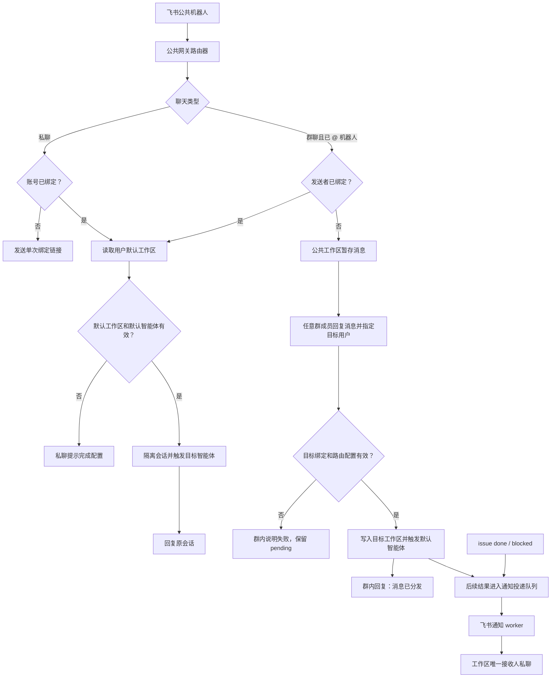

# 飞书公共网关与工作区通知实施方案

## 1. 方案结论

这次改造把飞书机器人从“某个普通智能体的聊天入口”提升为实例级公共网关，但仍保留当前代码里的重要约束：一个机器人安装只绑定一个工作区和一个智能体。

最终模型如下：

- 首位登录自建实例的用户成为超级管理员，负责完成实例初始化。
- 系统创建一个受保护的公共工作区和一个公共智能体，公共飞书机器人只绑定这个公共智能体。
- 公共机器人是全实例唯一的飞书入口，也是所有工作区主动通知的发送方。
- 飞书用户绑定到 Multica 账号，而不是绑定到公共工作区。一个 Multica 用户维护一个默认工作区。
- 每个工作区配置一个默认消息处理智能体，以及唯一一个飞书通知接收人。
- 已绑定用户发来的消息，按“飞书身份 → Multica 用户 → 默认工作区 → 默认智能体”路由。
- 未绑定用户在私聊中收到绑定入口；在群聊中发送的消息进入公共工作区暂存，不触发智能体运行。
- 群内任何成员都可以回复暂存消息并指定目标飞书用户。分发成功后只在群内确认“消息已分发”，后续进展改为私聊通知目标工作区的通知接收人。
- issue 进入 `done` 或 `blocked` 等通知事件通过独立投递队列发送，不能依赖聊天回复链路。

这个设计解决了两个容易混淆的问题：

1. **入站消息交给谁处理**，由发送者的默认工作区和该工作区的默认智能体决定。
2. **工作区通知发给谁**，由该工作区唯一的飞书通知接收人决定。

默认工作区用户和通知接收人可能是同一个人，也可以不同。两者不能共用一个字段。

## 2. 当前实现与改造原因

### 2.1 当前飞书链路

当前代码采用标准的“每个智能体一个机器人安装”模型：

```text
飞书 app_id
  → channel_installation
  → 固定 workspace_id
  → 固定 agent_id
  → channel_user_binding
  → chat_session
  → agent task
```

关键实现位置：

- `server/internal/integrations/lark/feishu_resolvers.go`
  - `app_id` 解析为唯一 `channel_installation`。
  - 用户绑定必须属于该安装记录的工作区。
  - 会话直接使用安装记录上的 `workspace_id` 和 `agent_id`。
- `server/internal/integrations/channel/engine/router.go`
  - 未绑定用户被归类为 `needs_binding`。
  - 已绑定用户经过身份校验后立即创建会话并触发智能体。
- `server/internal/integrations/lark/outbound.go`
  - 只处理带有飞书会话绑定的 `chat:done` 和 `task:failed`。
  - issue 或自动化任务没有 `chat_session_id`，会直接跳过。
- `server/cmd/server/notification_listeners.go`
  - issue 状态变化目前只创建 Multica 收件箱消息。
  - 事件总线是进程内同步总线，不具备重试和跨重启恢复能力。

### 2.2 为什么不能把同一个机器人绑定给多个普通智能体

飞书事件只携带机器人应用身份和消息来源。当前第一步用 `app_id` 找安装记录，如果同一机器人同时对应多个智能体，系统无法在处理消息前判断应该选哪一个智能体，也会破坏现有唯一索引和会话隔离。

公共网关方案不改变这一点。公共机器人仍只绑定公共智能体，真正的业务目标工作区和智能体由网关路由层二次解析。

### 2.3 为什么主动通知不能复用现有聊天回复

现有回复链路依赖 `channel_chat_session_binding`，目标是原始聊天窗口。主动通知有不同语义：

- issue 可能来自网页、API、自动化或后台智能体，没有飞书会话。
- 通知应始终发到工作区配置的接收人私聊，而不是原始群聊。
- 发送失败需要重试、审计和人工排查。
- 同一状态事件不能因为服务重启或事件重复而发出多次。

因此需要独立的通知投递表和后台 worker。

## 3. 目标、边界与系统约束

### 3.1 本期目标

- 支持首位用户成为超级管理员并初始化公共飞书网关。
- 支持飞书身份与 Multica 账号绑定。
- 支持用户设置唯一默认工作区。
- 支持工作区设置默认消息处理智能体和唯一飞书通知接收人。
- 支持已绑定用户的私聊、群聊消息按默认工作区路由。
- 支持未绑定群成员的消息暂存和后续分发。
- 支持 issue `done`、`blocked` 主动私聊通知。
- 支持分发任务的智能体回复完成和失败通知。
- 提供幂等、重试、审计和基础运维能力。

### 3.2 本期不做

- 一个飞书用户同时绑定多个默认工作区。
- 一个工作区配置多个飞书通知接收人。
- 按 issue、项目或智能体配置不同通知接收人。
- 在群里持续同步分发后任务的状态和回复。
- 允许公共智能体自动决定把未绑定消息分给谁。
- 旧的每智能体飞书机器人与公共网关长期双轨运行。
- 把 Slack 一并改造成公共网关。数据表可保留 `channel_type`，路由行为先只实现飞书。

### 3.3 必须保持的约束

- 一个 `channel_installation` 仍然只属于一个工作区和一个智能体。
- 公共工作区、公共智能体和公共飞书安装是系统保留资源，普通工作区管理员不能删除或迁移。
- 所有跨表关系由应用层校验和清理，不新增数据库外键或级联删除。
- 新索引必须使用 `CREATE [UNIQUE] INDEX CONCURRENTLY`，且每个索引单独一个 migration 文件。
- 群聊中的不同发送者即使位于同一个群，也必须形成相互隔离的目标工作区会话，不能共享业务上下文。

## 4. 目标架构



### 4.1 公共智能体的职责

公共智能体是公共飞书安装在现有模型中的合法宿主，同时也是公共工作区里暂存会话的归属智能体。它不自动处理未绑定用户的原始消息。

首期分发命令由服务端确定性解析，不让大模型直接执行跨工作区路由。建议交互为：

```text
群成员回复某条待分发消息：
@Multica 分发给 @张三
```

必须同时满足“回复待分发消息”和“包含一个目标用户 mention”。这样可以明确待分发记录和目标人，避免“把刚才那个给张三”一类存在歧义的指令。

以后如果要支持自然语言分发，可以给公共智能体增加一个受限工具。工具最终仍调用同一个 `DispatchPendingMessage` 服务，并由服务端执行权限、目标和幂等校验。

## 5. 核心数据模型

表名在实现时可以按仓库命名习惯微调，但字段职责不能合并。

### 5.1 `instance_state`

实例级单例，记录初始化状态和公共网关资源。

| 字段 | 说明 |
| --- | --- |
| `singleton_key` | 固定值，保证全实例只有一行 |
| `super_admin_user_id` | 首位成功创建的用户 |
| `public_workspace_id` | 公共工作区 |
| `public_agent_id` | 公共智能体 |
| `public_channel_installation_id` | 公共飞书安装，安装完成前可为空 |
| `initialized_at` | 公共工作区和智能体初始化完成时间 |
| `updated_at` | 更新时间 |

第一位用户的认领必须与用户创建放在同一事务中，并通过单例唯一索引解决并发首次登录竞争。不能先查用户数量再决定，因为两个并发注册都可能读到零。

公共工作区和公共智能体由超级管理员在初始化向导中创建。初始化接口必须幂等，重复提交返回已有资源。

### 5.2 `"user".default_workspace_id`

这是服务端持久化的账号级默认工作区，与 CLI 本地 profile 中的默认工作区不是同一概念。

规则：

- 用户第一次创建工作区时，如果该字段为空，在同一事务中写入新工作区。
- 修改默认工作区时必须验证用户仍是工作区成员。
- 用户退出或删除当前默认工作区时，事务内选择其最早加入的剩余工作区；没有剩余工作区则清空。
- 路由时发现值失效要失败关闭，提示用户重新选择，不能随机选一个工作区。

### 5.3 `channel_account_binding`

公共机器人下的飞书身份与 Multica 账号绑定。它与现有 `channel_user_binding` 分开。

| 字段 | 说明 |
| --- | --- |
| `id` | 记录标识 |
| `installation_id` | 公共飞书安装 |
| `channel_type` | 首期固定 `feishu` |
| `channel_user_id` | 飞书 `open_id` |
| `multica_user_id` | Multica 用户 |
| `config` | `union_id`、显示名等辅助信息 |
| `bound_at` | 绑定时间 |
| `updated_at` | 更新时间 |

唯一关系：

- 同一公共安装下，一个 `open_id` 只能绑定一个 Multica 用户。
- 同一公共安装下，一个 Multica 用户只能绑定一个 `open_id`。

不复用 `channel_user_binding` 的原因是：现有表带有 `workspace_id`，身份解析时还会检查用户是否属于安装所在工作区。公共机器人安装在公共工作区，但普通用户不应因此成为公共工作区成员。

### 5.4 `channel_account_binding_token`

用于公共机器人账号绑定的单次令牌，不能直接复用当前带 `workspace_id` 的 `channel_binding_token`。

字段至少包含：

- token hash，数据库不保存原始 token；
- 公共安装 ID；
- 飞书 `open_id`；
- 过期时间和消费时间；
- 可选的来源消息 ID；
- 创建时间。

约束：

- 有效期 15 分钟；
- 单次消费；
- 绑定写入和 token 消费在同一事务；
- 已绑定给其他账号时拒绝覆盖；
- 原始 token 不写日志、不进群消息。

### 5.5 `workspace_channel_setting`

保存工作区级飞书路由和通知设置。

| 字段 | 说明 |
| --- | --- |
| `workspace_id` | 工作区 |
| `channel_type` | `feishu` |
| `default_agent_id` | 入站消息默认处理智能体 |
| `notification_recipient_user_id` | 唯一通知接收人 |
| `notification_enabled` | 总开关 |
| `notification_events` | 初期为 `issue.done`、`issue.blocked`、`dispatch.completed`、`dispatch.failed` |
| `created_at` / `updated_at` | 审计时间 |

写入规则：

- 只有工作区 owner/admin 可修改。
- 默认智能体必须属于该工作区、未归档且调用权限允许该工作区使用。
- 通知接收人必须是当前工作区成员，并且已在公共飞书安装下完成账号绑定。
- 智能体被归档或删除时清空 `default_agent_id`，不自动选择另一个智能体。
- 通知接收人离开工作区或解绑飞书时清空接收人并暂停投递。

### 5.6 `channel_pending_dispatch`

保存未绑定群成员发来的待分发消息及其状态。

| 字段组 | 关键字段 |
| --- | --- |
| 来源 | `installation_id`、`channel_chat_id`、`channel_thread_id`、`channel_message_id` |
| 发送者 | `sender_channel_user_id`、可空的 `sender_multica_user_id` |
| 内容 | `content`、受控的 `source_payload`、`public_chat_session_id` |
| 状态 | `pending`、`dispatched`、`cancelled` |
| 分发操作 | `dispatch_message_id`、`dispatched_by_channel_user_id`、可空的 `dispatched_by_multica_user_id` |
| 目标 | `target_channel_user_id`、`target_multica_user_id`、`target_workspace_id`、`target_agent_id`、`target_chat_session_id` |
| 结果 | `dispatched_at`、`failure_code`、`updated_at` |

同一公共安装和原始飞书消息 ID 只能产生一条待分发记录。

暂存时需要在同一事务中：

1. 在公共工作区创建或复用群聊暂存会话；
2. 写入原始用户消息；
3. 写入 `channel_pending_dispatch`；
4. 标记入站去重记录已完成；
5. 不创建 `agent_task_queue` 记录。

分发时通过条件更新把 `pending` 改为 `dispatched`。两个群成员并发分发同一消息时，只允许一个成功，另一个收到“该消息已分发”的幂等结果。

### 5.7 `channel_notification_delivery`

主动通知的持久化 outbox。

| 字段组 | 关键字段 |
| --- | --- |
| 幂等 | `idempotency_key` |
| 来源 | `event_type`、`workspace_id`、`issue_id`、`task_id`、`chat_session_id` |
| 目标快照 | `installation_id`、`recipient_user_id`、`recipient_channel_user_id` |
| 内容 | `payload`、`render_version` |
| 状态 | `pending`、`sending`、`sent`、`dead`、`cancelled` |
| 重试 | `attempt_count`、`next_attempt_at`、`lease_token`、`lease_expires_at` |
| 结果 | `channel_message_id`、`last_error_code`、`sent_at`、`created_at`、`updated_at` |

接收人的 `open_id` 在入队时做快照。后续更换通知接收人只影响新事件，不会把已经排队的通知静默改发给另一个人。管理员可以取消旧的 pending 投递。

## 6. 关键业务流程

### 6.1 首次启动与超级管理员初始化

1. 第一个完成账号创建的用户在事务中认领 `instance_state.super_admin_user_id`。
2. 登录后发现实例未初始化，前端进入实例初始化向导。
3. 超级管理员确认公共工作区名称，服务端创建公共工作区和公共智能体。
4. 向导启动现有飞书 device flow，但安装目标由服务端固定为公共工作区和公共智能体，客户端不能提交任意目标 ID。
5. 安装成功后写入 `public_channel_installation_id`，启动或刷新飞书 WebSocket supervisor。
6. 健康检查通过后实例进入 `ready`。

公共资源需要增加删除保护：

- 普通工作区删除接口拒绝删除公共工作区。
- 普通智能体归档、runtime 删除和工作区清理路径拒绝删除公共智能体。
- 公共飞书安装只能由超级管理员在实例设置中重连或撤销。

### 6.2 未绑定用户私聊机器人

1. 网关收到 P2P 消息，按公共安装查询 `channel_account_binding`。
2. 未找到绑定时生成单次 token。
3. 机器人通过 `open_id` 向该用户发送绑定卡片。
4. 用户打开 `/lark/bind?token=...`：
   - 未登录：先登录或创建账号，保留 return URL。
   - 登录后没有工作区：进入工作区创建步骤。
   - 第一个工作区创建成功后自动成为默认工作区。
   - 消费 token，写入账号绑定。
5. 完成后私聊提示用户继续发送消息。

私聊消息是飞书允许机器人回复用户的会话上下文。系统不尝试向从未与机器人建立会话、也没有 `open_id` 绑定的用户主动发消息。

### 6.3 已绑定用户私聊

路由链路：

```text
open_id
  → channel_account_binding.multica_user_id
  → user.default_workspace_id
  → workspace_channel_setting.default_agent_id
  → 目标 chat_session
  → agent task
```

会话隔离 key 建议为：

```text
p2p:{open_id}:{workspace_id}:{agent_id}
```

用户切换默认工作区或工作区切换默认智能体后，新消息进入新的会话，不会把旧工作区上下文带过去。实际飞书 `chat_id` 保存在 binding config 中用于回复。

缺少配置时：

- 没有默认工作区：提示用户创建或选择默认工作区。
- 不是默认工作区成员：清除失效默认值并提示重新选择。
- 没有默认智能体：提示工作区管理员完成配置。
- 默认智能体已归档、离线或不可调用：沿用现有明确的错误提示，不回退到其他智能体。

### 6.4 已绑定用户在群里 @ 机器人

发送者已绑定时，同样路由到该发送者的默认工作区和默认智能体。

同一飞书群里可能有多个 Multica 用户，且默认工作区不同。会话 key 必须包含发送者、目标工作区和智能体：

```text
group:{chat_id}:{thread_id-or-root}:{sender_open_id}:{workspace_id}:{agent_id}
```

这样 Alice 和 Bob 在同一个群 @ 机器人时不会进入同一个 Multica 会话，更不会发生跨工作区消息泄漏。

智能体的即时回答可以回复原群聊或原话题；后续 issue 状态和异步任务通知只发到目标工作区配置的私聊接收人。

### 6.5 未绑定用户在群里 @ 机器人

1. 机器人只处理明确 @ 自己的消息。
2. 网关发现发送者未绑定。
3. 消息写入公共工作区暂存会话和 `channel_pending_dispatch`。
4. 不生成绑定 token 到群里，不运行公共智能体，不创建业务 issue。
5. 机器人在群里给出不含敏感链接的确认，例如“消息已暂存，请回复该消息并 @ 目标用户进行分发”。

绑定 token 不能直接发在群里，否则其他成员可以点击并尝试抢占绑定。若未绑定用户希望建立账号关系，需要主动私聊公共机器人获取专属绑定卡片。

### 6.6 群聊待办分发

任何群成员都可以发起分发，不要求其已经绑定 Multica 账号。

服务端收到“回复待分发消息 + @ 机器人 + 分发给 @目标用户”后：

1. 用被回复消息 ID 查找 `pending` 记录。
2. 从 mention 中提取唯一目标飞书 `open_id`。
3. 查询目标 `channel_account_binding`。
4. 查询目标用户当前默认工作区。
5. 验证目标仍是工作区成员。
6. 查询工作区默认智能体并验证可用性。
7. 在一个事务中：
   - 锁定或条件更新 pending 记录；
   - 在目标工作区创建新的聊天会话；
   - 以系统导入消息写入原始内容和来源说明；
   - 创建目标智能体任务；
   - 更新目标与操作者审计字段；
   - 标记分发命令的入站去重记录。
8. 事务成功后在群里回复发起分发的人：“消息已分发给 @目标用户”。

导入目标工作区的消息必须保留：

- 原群名称和群 ID；
- 原始发送者飞书显示名和 `open_id`；
- 原始消息 ID、时间和可用的跳转链接；
- 分发操作者；
- 目标用户、工作区和智能体；
- 原始正文和受支持附件引用。

原始未绑定发送者只是外部来源，不能伪装成目标工作区成员。目标会话和任务的系统 actor 使用 `system`，业务发起人记录在 attribution/source metadata 中。

任一步骤失败都不改变 pending 状态，并在群里返回可操作原因：

- 目标用户尚未绑定；
- 目标用户没有默认工作区；
- 目标用户已不属于默认工作区；
- 目标工作区没有默认智能体；
- 该消息已被其他人分发。

### 6.7 issue 主动通知

首期订阅以下状态边：

- 进入 `done`；
- 进入 `blocked`。

只有状态发生变化时入队，重复保存同一状态不发送。建议幂等 key：

```text
feishu:issue-status:{issue_id}:{to_status}:{issue_updated_at}
```

入队时读取工作区设置：

1. 飞书通知总开关开启；
2. 事件类型已启用；
3. 通知接收人仍是工作区成员；
4. 接收人在公共安装下存在账号绑定；
5. 公共安装处于 active 状态。

通知卡片至少包含：

- 工作区名称；
- issue 标识和标题；
- 当前状态；
- 实际负责的成员或智能体；
- 状态变化时间；
- issue 深链接；
- `blocked` 时可附最近一条阻塞原因或失败摘要。

工作区只有一个接收人，因此这里不复用 issue 订阅者列表，也不受现有个人收件箱偏好影响。飞书通知开关和事件范围由 `workspace_channel_setting` 单独控制。

### 6.8 分发后任务通知

由群聊分发创建的目标会话不应把智能体最终回复继续发回群里。其 `chat:done` 和 `task:failed` 生成私聊通知：

- `dispatch.completed`：包含智能体回复摘要和打开 Multica 会话的链接。
- `dispatch.failed`：包含失败摘要和重试入口。

普通已绑定用户直接在飞书发起的聊天，仍沿用现有回复原会话的行为，不重复生成私聊通知。两者通过会话 source metadata 或 `channel_pending_dispatch.target_chat_session_id` 区分。

## 7. 入站路由改造

不建议直接把公共网关逻辑塞进通用 `engine.Router` 的每一个 resolver。Slack 和旧的普通安装不需要知道默认工作区、公共暂存和分发语义。

增加一层飞书专用 `GatewayRouter`：

```text
feishuChannel
  → GatewayRouter
      ├─ 普通安装：交给现有 engine.Router
      └─ 公共安装：
          ├─ 账号解析
          ├─ 私聊/群聊分流
          ├─ pending/dispatch 处理
          └─ 组装动态 ResolvedInstallation 后交给 engine.Router
```

对已绑定用户，`GatewayRouter` 解析出目标工作区和智能体后，可以构造动态的 `ResolvedInstallation` 交给现有会话追加、`/issue`、任务触发和回复逻辑。公共安装 ID 与飞书凭据保持不变，目标 `workspace_id` 和 `agent_id` 使用本次路由结果。

需要调整两个通用扩展点：

1. 会话 resolver 接收显式的 session isolation key，允许公共网关加入发送者和目标工作区信息。
2. 群聊 session creator 不再无条件使用安装者。公共网关路由到普通工作区时，应使用目标 Multica 用户；公共暂存会话使用超级管理员或系统初始化用户。

对于未绑定群消息，`GatewayRouter` 不进入现有 `processClaimed` 的身份失败分支，而是走独立的 `PendingDispatchService`，否则现有代码只会记录 `unbound_user` 并发绑定卡片。

## 8. 主动通知投递

### 8.1 入队

新增 `FeishuNotificationEnqueuer`，订阅：

- `issue:updated`；
- `chat:done`；
- `task:failed`。

它只做轻量解析、配置校验和 outbox 插入，不在事件监听器内直接调用飞书 HTTP API。

当前事件总线在数据库提交后同步发布，监听器写 outbox 可以覆盖绝大多数场景，但仍存在“业务数据已提交、进程在 outbox 写入前退出”的极小窗口。实施分两步：

- 第一阶段：事件监听器写持久 outbox，依靠幂等和重试解决发送失败，先交付可用能力。
- 加固阶段：将 issue 状态变更和 outbox 写入收敛到同一业务事务，或引入通用 domain outbox。上线前如果要求严格不丢通知，应把该加固项提升为阻塞条件。

### 8.2 Worker

新增 `FeishuNotificationWorker`：

- 批量领取 `pending` 且到期的记录；
- 使用 lease token 防止多实例重复领取；
- 将状态改为 `sending`；
- 通过公共安装解密凭据；
- 使用 `receive_id_type=open_id` 发送私聊文本或卡片；
- 成功后保存飞书 message ID 并改为 `sent`；
- 失败后指数退避并记录结构化错误；
- 超过最大次数后改为 `dead`。

建议重试间隔为 30 秒、2 分钟、10 分钟、30 分钟、2 小时，最多 5 次。认证失效、安装撤销等明确不可恢复错误可直接进入 `dead`；限流和网络错误继续重试。

### 8.3 运维能力

至少提供：

- pending、sent、dead 数量指标；
- 投递延迟和飞书 API 错误码指标；
- 不含正文和 token 的结构化日志；
- 超级管理员查看失败投递和手动重试的接口；
- 公共安装撤销时暂停 worker；
- 服务启动时回收过期 `sending` lease。

## 9. API 设计

路径可在实现时按现有 router 风格调整，推荐 contract 如下。

### 9.1 实例初始化

```http
GET  /api/instance/bootstrap
POST /api/instance/bootstrap
POST /api/instance/lark/install/begin
GET  /api/instance/lark/install/{sessionId}/status
DELETE /api/instance/lark/installations/{installationId}
```

- `GET` 对已登录用户返回初始化状态；敏感安装信息只对超级管理员返回。
- `POST bootstrap` 仅超级管理员可调用，幂等创建公共工作区和公共智能体。
- 安装接口的目标资源由服务端从 `instance_state` 读取，不接受客户端传入任意 `agent_id`。

### 9.2 用户默认工作区与飞书账号

```http
GET   /api/me/default-workspace
PATCH /api/me/default-workspace
GET   /api/me/channel-bindings/feishu
DELETE /api/me/channel-bindings/feishu
POST  /api/lark/account-binding/redeem
```

解绑前检查该用户是否是某个工作区当前通知接收人。若是，需要明确确认并在事务中清理相关设置和待投递通知。

### 9.3 工作区飞书设置

```http
GET   /api/workspaces/{id}/channel-settings/feishu
PATCH /api/workspaces/{id}/channel-settings/feishu
POST  /api/workspaces/{id}/channel-settings/feishu/test
```

`PATCH` 支持设置：

- `default_agent_id`；
- `notification_recipient_user_id`；
- `notification_enabled`；
- `notification_events`。

测试接口向当前接收人发送一条明确标注为测试的通知，也通过 outbox 投递。

### 9.4 公共暂存与投递

群聊分发主要由飞书消息触发。为排障和公共工作区 UI 提供只读接口：

```http
GET  /api/workspaces/{publicWorkspaceId}/pending-dispatches
GET  /api/workspaces/{publicWorkspaceId}/pending-dispatches/{id}
POST /api/instance/notification-deliveries/{id}/retry
```

公共暂存列表只对超级管理员可见，避免未绑定用户消息被普通成员浏览。

## 10. 前端改造

### 10.1 实例初始化向导

新增实例级 setup 页面，步骤为：

1. 确认超级管理员身份；
2. 创建公共工作区和公共智能体；
3. 扫码绑定公共飞书机器人；
4. 校验连接状态；
5. 完成。

普通用户不能看到创建公共资源或绑定公共机器人的入口。

### 10.2 账号设置

在“我的账户”中增加：

- 默认工作区选择；
- 飞书账号绑定状态；
- 解绑入口。

默认工作区选择使用服务端 React Query 数据，不能只写 Zustand 或本地存储。

### 10.3 工作区设置

在“集成 → 飞书”中替换当前普通工作区的“给智能体绑定机器人”主入口，改为：

- 公共机器人连接状态，只读展示；
- 默认消息处理智能体选择；
- “新建智能体并设为默认”入口；
- 唯一通知接收人选择；
- 通知事件开关；
- 发送测试通知。

选择通知接收人时只列出同时满足以下条件的成员：

- 当前工作区成员；
- 已绑定公共飞书机器人账号。

### 10.4 绑定页面

现有 `packages/views/lark/bind-page.tsx` 假定用户已经属于安装所在工作区，需要改为账号绑定流程：

- 登录后先判断用户是否有工作区；
- 没有工作区时进入 onboarding 的工作区创建步骤；
- 工作区创建完成后回到 token redemption；
- 成功响应返回用户 ID、默认工作区和绑定状态，不再返回安装工作区作为业务目标。

## 11. 实施单元

### U1. 实例身份与初始化

**目标：** 建立超级管理员、公共工作区和公共智能体。

主要改动：

- 新增 `instance_state` schema 和 queries。
- 将“首位用户认领超级管理员”并入 `findOrCreateUser` 的事务路径。
- 新增 bootstrap service 和 handler。
- 在工作区、智能体、runtime 和安装删除路径加入公共资源保护。
- 新增初始化向导和权限状态。

验证重点：

- 两个首次注册并发时只有一名超级管理员；
- bootstrap 重复调用不重复创建资源；
- 非超级管理员无法初始化、重连或删除公共网关。

### U2. 账号绑定与默认工作区

**目标：** 将飞书 `open_id` 绑定到 Multica 用户，并建立唯一默认工作区。

主要改动：

- 新增 `channel_account_binding`、`channel_account_binding_token`。
- 给用户增加服务端 `default_workspace_id`。
- 改造公共机器人绑定卡片和 redemption。
- 修改创建工作区、退出成员、删除工作区路径，维护默认工作区。
- 增加账号设置 API、React Query hooks 和 UI。

验证重点：

- token 单次消费、过期、重放和抢绑定；
- 首个工作区自动成为默认；
- 切换默认工作区必须具有成员关系；
- 删除默认工作区后按规则选择剩余工作区。

### U3. 工作区飞书路由设置

**目标：** 配置默认智能体和唯一通知接收人。

主要改动：

- 新增 `workspace_channel_setting` 和 settings service。
- 实现工作区设置 API。
- 在智能体归档/删除、成员移除、飞书解绑路径中清理失效引用。
- 改造 Integrations 页面。

验证重点：

- 普通成员只读，owner/admin 可写；
- 不能选择其他工作区的智能体；
- 不能选择未绑定飞书的通知接收人；
- 引用资源失效后停止路由和通知。

### U4. 公共网关入站路由

**目标：** 已绑定用户动态路由到默认工作区和默认智能体。

主要改动：

- 在 `server/internal/integrations/lark/` 增加 `GatewayRouter` 和 resolver。
- 调整飞书 channel 注册，使公共安装先经过网关。
- 扩展 session isolation key 和动态目标上下文。
- 保留普通安装兼容路径用于迁移期验证，公共网关启用后停止创建新的普通飞书安装。

验证重点：

- 私聊和群聊均正确路由；
- 同群不同发送者、不同工作区完全隔离；
- 切换默认工作区后创建新会话；
- 缺少默认设置时不触发智能体。

### U5. 群聊暂存与分发

**目标：** 未绑定群消息进入公共工作区，并可由任何群成员分发。

主要改动：

- 新增 `channel_pending_dispatch` 和 `PendingDispatchService`。
- 解析 reply message 与目标 mention。
- 实现公共暂存事务和目标工作区导入事务。
- 增加群内暂存、成功和失败回复。
- 在公共工作区提供待分发记录查看能力。

验证重点：

- 未绑定群消息不产生智能体任务；
- 未 @ 机器人的群消息继续忽略；
- 未绑定操作者也能分发；
- 同一消息并发分发只成功一次；
- 目标配置无效时保留 pending；
- 群里不暴露绑定 token。

### U6. 主动通知 outbox

**目标：** issue 和分发任务通过公共机器人可靠私聊通知。

主要改动：

- 新增 `channel_notification_delivery`。
- 增加 issue/chat/task 事件 enqueuer。
- 增加 worker、lease、退避和 dead-letter 处理。
- 扩展飞书 client，支持通用 `open_id` 文本和卡片发送并返回 message ID。
- 增加通知模板、深链接和负责人解析。
- 增加指标、日志、测试通知和人工重试接口。

验证重点：

- `done`、`blocked` 状态边各入队一次；
- 同一事件重复发布不会重复发送；
- 每个工作区只有一个目标接收人；
- 发送目标为私聊 `open_id`，不使用原群 `chat_id`；
- 失败重试，服务重启后继续；
- 分发任务完成后不再向原群发送生命周期消息。

### U7. 迁移、切换与文档

**目标：** 从现有每智能体飞书机器人模式安全切换。

主要改动：

- 增加公共网关 readiness 检查。
- 停止普通工作区创建新的飞书安装。
- 提供旧安装清单和撤销指引。
- 更新自建部署文档、飞书权限清单、设置说明和故障排查。
- 更新相关 CLI/内置 skill 文档，避免继续引导用户按智能体安装飞书机器人。

### 预计代码触点

| 区域 | 主要文件或目录 | 改动 |
| --- | --- | --- |
| 数据库 | `server/migrations/` | schema migration 与逐个 concurrent index migration |
| SQL queries | `server/pkg/db/queries/user.sql`、`workspace.sql`、`channel.sql`，以及新的 instance/gateway queries | 默认工作区、公共网关、账号绑定、暂存和 outbox 读写 |
| 登录和初始化 | `server/internal/handler/auth.go`、新的 instance bootstrap handler/service | 首位超级管理员认领、公共资源初始化 |
| 工作区生命周期 | `server/internal/handler/workspace.go`、成员和智能体删除/归档路径 | 默认工作区维护、公共资源保护、软引用清理 |
| 飞书绑定 | `server/internal/integrations/lark/binding_token.go`、`outcome_replier.go`、新的 account binding service | 公共账号绑定 token 和私聊卡片 |
| 飞书入站 | `server/internal/integrations/lark/feishu_channel.go`、`feishu_resolvers.go`、新的 `gateway_router.go` | 识别公共安装、动态目标路由 |
| 通用会话引擎 | `server/internal/integrations/channel/engine/router.go`、`session.go` | 显式 session key、动态 creator 和目标上下文 |
| 暂存与分发 | 新的 `server/internal/integrations/lark/pending_dispatch*.go` | pending 写入、分发命令解析、目标导入 |
| 主动通知 | 新的 `server/internal/integrations/lark/notification*.go`、`server/cmd/server/notification_listeners.go` | outbox 入队、worker、模板和重试 |
| 启动 wiring | `server/cmd/server/router.go`、`main.go` | gateway、worker、handler 和 shutdown 生命周期 |
| 前端 API/状态 | `packages/core/api/`、`packages/core/lark/`、workspace/user query modules | React Query contracts、mutations 和缓存失效 |
| 设置与绑定 UI | `packages/views/settings/`、`packages/views/lark/bind-page.tsx`、`packages/views/onboarding/` | 初始化、默认工作区、工作区飞书设置和绑定续接 |
| 文档与本地化 | `apps/docs/`、`packages/views/locales/{en,zh-Hans,ja,ko}/` | 自建部署、飞书权限、交互文案和排障说明 |

## 12. Migration 规划

当前 main 最新 migration 为 `223`。具体编号在编码开始时重新确认，预计拆分为：

1. `224_*_schema.up.sql`
   - 增加用户默认工作区字段；
   - 创建新表；
   - 不创建普通索引、唯一索引或新表主键索引；
   - 不增加外键。
2. `225+`
   - 每个 `CREATE INDEX CONCURRENTLY` 或 `CREATE UNIQUE INDEX CONCURRENTLY` 单独一个 migration 文件。

需要的唯一索引至少包括：

- `instance_state(singleton_key)`；
- `channel_account_binding(installation_id, channel_user_id)`；
- `channel_account_binding(installation_id, multica_user_id)`；
- `channel_account_binding_token(token_hash)`；
- `workspace_channel_setting(workspace_id, channel_type)`；
- `channel_pending_dispatch(installation_id, channel_message_id)`；
- `channel_pending_dispatch(installation_id, dispatch_message_id)` 的非空部分唯一索引；
- `channel_notification_delivery(idempotency_key)`。

需要的查询索引至少包括：

- pending dispatch 按公共工作区、状态、创建时间；
- notification delivery 按状态、下次重试时间；
- account binding 按 Multica user；
- workspace channel setting 按通知接收人和默认智能体，用于资源清理。

所有 down migration 要显式删除对应索引和表/字段。工作区删除、用户解绑、成员移除和智能体删除还要同步更新应用层清理 SQL。

## 13. 迁移与上线策略

### 13.1 新实例

新实例直接进入初始化向导，完成公共网关后才开放飞书设置。其他 Multica 功能不因飞书未配置而阻塞。

### 13.2 已有实例

现有飞书 `open_id` 是应用维度身份。换成新的公共飞书应用后，旧机器人下的用户绑定通常不能安全迁移，因此采用显式重新绑定：

1. 升级后先创建公共工作区和公共智能体。
2. 超级管理员安装公共机器人。
3. 运行健康检查，验证入站、私聊发送和凭据解密。
4. 工作区管理员配置默认智能体和通知接收人。
5. 用户私聊新公共机器人完成账号绑定。
6. 公共网关标记为 ready 后，前端停止展示普通智能体飞书安装入口。
7. 撤销旧安装并停止其 supervisor。
8. 保留旧安装和会话数据一段只读观察期，确认无回滚需要后再清理。

不要让同一个业务消息同时进入旧安装和公共网关。切换开关必须以公共安装为单位，不能按消息做双写。

### 13.3 功能开关

建议增加实例级 `feishu_public_gateway` rollout flag：

- `off`：保持当前行为；
- `setup`：允许超级管理员初始化，普通飞书入口仍只读；
- `active`：公共网关处理入站和通知，禁止新建普通飞书安装；
- `paused`：保留数据，暂停入站和通知 worker，用于事故处理。

状态存数据库，环境变量只控制功能是否可用，避免多实例配置不一致。

## 14. 安全与权限

- 公共飞书凭据沿用 secretbox 加密，不以明文写数据库、日志或事件 payload。
- 绑定 token 只保存 hash，15 分钟失效，单次消费。
- 群聊不发送含 token 的绑定 URL。
- 飞书事件仍需经过官方长连接或签名可信通道，保留消息去重。
- 任意群成员可发起分发，但只能把消息分给已绑定用户，不能直接提交任意 Multica user/workspace/agent ID。
- 目标工作区和智能体必须由目标用户当前配置解析，不能由操作者指定，以免跨租户注入。
- 原始外部发送者不成为目标工作区成员，也不作为目标任务的 Multica actor。
- 通知接收人必须同时具备工作区成员关系和公共飞书账号绑定。
- 公共待分发正文可能包含敏感信息，应与聊天消息遵循相同保留和删除策略。
- 日志只记录 record ID、workspace ID、event type、飞书错误码和 hash 后的目标标识，不记录消息正文、token、app secret。

## 15. 测试与验收

### 15.1 服务端单元与集成测试

- 并发首次注册只有一位超级管理员。
- bootstrap 幂等且公共资源受保护。
- 账号绑定 token 的过期、重放、抢占和事务回滚。
- 默认工作区创建、切换、退出和删除。
- 工作区设置的权限、成员关系和智能体归属校验。
- 同一群中两个用户路由到两个不同工作区时，会话和任务完全隔离。
- 未绑定私聊只发绑定卡片，不触发任务。
- 未绑定群聊只暂存，不发绑定 token，不触发任务。
- 任意群成员可分发，且分发者是否绑定不影响结果。
- 目标用户缺少绑定、默认工作区或默认智能体时分发失败且 pending 保留。
- 同一原始消息和同一分发命令重复到达时保持幂等。
- issue 进入 `done`、`blocked` 时只创建一次投递。
- 通知始终使用公共安装和接收人 `open_id`。
- worker 多实例竞争、lease 过期回收、重试和 dead 状态。
- 工作区删除、成员移除、智能体删除和飞书解绑的应用层清理。

### 15.2 前端测试

- 非超级管理员看不到实例初始化和机器人管理操作。
- 没有工作区的绑定用户能完成登录 → 创建工作区 → redemption。
- 默认工作区选择使用服务端状态并正确刷新。
- 默认智能体和通知接收人候选列表正确过滤。
- 无已绑定成员时给出明确空状态。
- 测试通知显示 queued/sent/failed 状态。
- 四种语言的新增文案和错误提示完整。

### 15.3 端到端验收场景

**AE1：已绑定私聊**

Given 用户已绑定飞书，默认工作区为 A，A 的默认智能体为 Agent-A。  
When 用户私聊公共机器人。  
Then 消息进入 A 的 Agent-A 会话，回复回到该私聊。

**AE2：同群多工作区隔离**

Given Alice 默认工作区为 A，Bob 默认工作区为 B。  
When 两人在同一群分别 @ 公共机器人。  
Then 两条消息进入不同工作区和不同会话，任何一方看不到另一方上下文。

**AE3：未绑定群消息暂存**

Given Carol 未绑定 Multica。  
When Carol 在群里 @ 公共机器人发送需求。  
Then 公共工作区出现一条 pending 记录，没有智能体任务，也没有群内绑定链接。

**AE4：任意成员分发**

Given Carol 的消息处于 pending，Dave 未绑定 Multica。  
When Dave 回复该消息并要求分发给已绑定的 Alice。  
Then 消息进入 Alice 当前默认工作区的默认智能体，群里回复 Dave“消息已分发”。

**AE5：分发失败可恢复**

Given 目标用户没有默认智能体。  
When 群成员尝试分发。  
Then 群里提示目标工作区尚未配置默认智能体，pending 保持不变；配置完成后可重新分发。

**AE6：issue 私聊通知**

Given 工作区 A 的飞书接收人为 Alice。  
When A 中任意 issue 从 `in_progress` 进入 `blocked` 或 `done`。  
Then 公共机器人只给 Alice 私聊一次，原群不收到状态通知。

**AE7：通知故障恢复**

Given 飞书 API 临时限流。  
When worker 发送通知失败。  
Then 投递记录进入重试，服务重启后继续，成功后保存飞书 message ID，不产生重复通知。

## 16. 风险与应对

### 16.1 动态路由破坏租户隔离

公共安装对应多个业务工作区后，任何遗漏 workspace 校验的查询都可能造成跨租户泄漏。网关路由结果应封装为不可变 `GatewayTarget`，包含 user、workspace、agent 和配置版本；后续服务只使用该对象，不重新从客户端参数拼装目标。

### 16.2 群聊会话 key 过于粗糙

复用原 `chat_id` 会让同群所有人共享会话。必须将发送者、工作区、智能体和 thread 纳入隔离 key，并为 key 长度和字符编码写单元测试。

### 16.3 通知事件丢失

进程内事件总线与业务事务之间存在提交窗口。第一阶段用持久 outbox、幂等和告警降低风险；严格可靠性上线前，把业务状态更新和 outbox 写入同一事务。

### 16.4 公共工作区积压敏感消息

需要配置保留期和清理任务。建议 pending 成功分发后保留 30 天审计，未分发记录保留 90 天后由超级管理员确认归档；具体期限可在部署配置中调整。

### 16.5 `open_id` 的应用作用域

`open_id` 只能在同一个飞书应用内使用。所有账号绑定和通知目标都必须带公共安装 ID，不能拿旧机器人或其他应用的 `open_id` 直接发送。

### 16.6 公共机器人失效影响全实例

它会成为飞书单点。需要：

- 安装健康检查；
- supervisor 和通知 worker 独立指标；
- 凭据失效告警；
- 超级管理员快速重连入口；
- `paused` 状态下保持 Multica 主业务可用。

## 17. 推荐实施顺序

```text
U1 实例身份与初始化
  ↓
U2 账号绑定与默认工作区
  ↓
U3 工作区飞书路由设置
  ↓
U4 已绑定用户动态路由
  ↓
U5 群聊暂存与分发
  ↓
U6 主动通知 outbox
  ↓
U7 迁移、切换与文档
```

U1～U3 建立稳定的数据和权限边界。U4 验证公共机器人能够安全服务多个工作区。U5 引入公共暂存和跨工作区分发。U6 再接入主动通知，避免通知链路建立在尚未稳定的身份路由上。

每个单元应独立提交并具备对应测试。U4、U5 和 U6 不建议合并成一个大改动，否则入站路由、跨工作区权限和异步投递发生问题时难以定位和回滚。

## 18. 完成定义

满足以下条件后可以认为公共飞书网关首期完成：

- 自建实例首位用户能够完成公共机器人初始化。
- 普通用户能通过私聊完成账号绑定和首个工作区创建。
- 用户能切换唯一默认工作区。
- 工作区管理员能配置默认智能体和唯一通知接收人。
- 已绑定私聊、已绑定群聊、未绑定群聊暂存、任意成员分发四条链路全部通过端到端测试。
- issue `done`、`blocked` 和分发任务完成/失败能可靠私聊通知。
- 原群只收到即时回答、暂存提示和分发确认，不收到后续生命周期通知。
- 多工作区、多用户、同群并发场景没有跨租户会话污染。
- outbox 能重试、恢复、去重和暴露失败记录。
- 旧的每智能体飞书安装入口完成下线或明确进入只读迁移状态。
- `make test`、`pnpm test`、`pnpm typecheck` 和相关集成测试通过。
